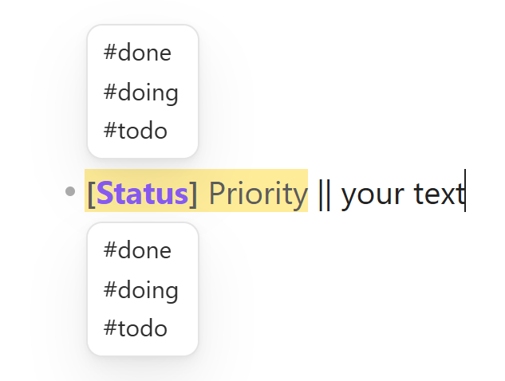

<div align="center">

<picture>
  <source media="(prefers-color-scheme: dark)" srcset="docs/brand/io-wordmark-dark-anim.svg">
  
</picture>

**Turn a raw thought into a structured line without leaving it.**

[](https://obsidian.md)
[](https://github.com/romkuznetsov/inline-overhaul/releases)
[](#install)
[](LICENSE)

<picture>
  <source media="(prefers-color-scheme: dark)" srcset="docs/media/readme/line-dark.png">
  
</picture>

[Install](#install) · [Tutorial](docs/TUTORIAL.md) · [Showcase](docs/SHOWCASE.md) · [All features](FEATURES.md)

</div>

You write down a raw thought:

```markdown
- call the bank
```

A few keystrokes and about five seconds later it will be like this:

```markdown
- [ ] #todo #high || call the bank || [[Project A]] 📅2026-09-15
```

<details>
<summary><b>This is how it will look in your note</b></summary>
<br>
<picture>
  <source media="(prefers-color-scheme: dark)" srcset="docs/media/readme/line-dark.png">
  
</picture>
</details>

<details>
<summary><b>…or like this, after a few changes in the settings</b></summary>
<br>
<picture>
  <source media="(prefers-color-scheme: dark)" srcset="docs/media/readme/line-tuned-dark.png">
  
</picture>
</details>

Your whole PKM — status, priority, project, dates and so on — lives right in the line.
You no longer have to remember whether you mark tasks `#todo` or `#task`: set it up once and it stays that way forever.
It reduces decision fatigue and mental exhaustion to almost zero.

<picture>
  <source media="(prefers-color-scheme: dark)" srcset="docs/media/readme/tagwheel-dark.png">
  
</picture>

And all the Values are ordinary markdown: the tags are searchable by Obsidian, the link is a real wikilink, and the emoji-element is text that Tasks and Dataview can read.

That is only the tip of the iceberg — inlineOverhaul makes a lot of things in Obsidian MUCH smoother.

## What you get

Section names match the tabs of the settings panel, so what you read here is where you find it later.

### Tags & PKM — a line that carries your own PKM system

- **Fields you design.** A status, a priority, a project, a due date: each is a Field (e.g. `Priority`) with its own Values (e.g. `high`, `low`). The plugin ships no methodology of its own, so GTD, PARA or a system you invented would all fit.
- **A command for every Field.** `Status next` walks `#todo → #doing → #done` in place, without touching the words around it.
- **Three kinds of Value.** Tags (`#todo`), wikilinks (`[[Project A]]`) and emoji-elements such as `📅2026-09-15`, which step the way you want: by a day, by a counter of your own, or through a list you write.

<!-- GIF: cycling a Field on a line -->

### tagWheel — choose instead of typing

You do not have to remember every Value or every command: one command holds them all. The tagWheel panel shows every Field of the line with its Values — walk them with the arrow keys, press `Enter`, and the Values you picked land in the line where they belong.

<!-- GIF: picking Values with tagWheel -->

### Transform (inline2note) — turn a line into a note in one click

The inline2note floating button takes the line with its Values and the template you choose, and creates a note from it. Each Value becomes a YAML property, and you decide which one goes where. Smart Rules pick the template, so a line with `#meeting` and a line with `#bug` become different kinds of note.

Because the properties are real frontmatter, a transformed note shows up in Bases and Dataview.

<!-- GIF: turning a line into a note with inline2note -->

### Navigation — move a line with everything it carries

- **Move up and down** the line or the whole tree.
- **Move left and right** cycles the Prefix (bullet, checkbox, quote, heading), so restructuring a note does not mean retyping it.
- **Jump** the cursor between headings, and through the parts of one line.

<!-- GIF: moving lines and trees -->

### Keyboard — the keys you press all day, made smarter

- **Smart `Ctrl+A`** widens the selection a step at a time: word, line, block, note.
- **Smart Enter** adds a line below instead of splitting yours; **Delete** and **Backspace** step over the indent and the Prefix.
- **Binder** puts any snippet on a hotkey, and `Smart bracket` ships with it.

### Visual — see the PKM structure of a line at a glance

Tags drawn as bubbles in your colors, a Stripe behind a Block, Tag Bars down the margin, and a caret you can restyle. This is drawing only: the file on disk stays untouched.

<!-- GIF: the Visual tab — bubbles, Stripe, Tag Bars, caret -->

## First steps

1. **Give the commands keys.** The plugin assigns no hotkeys, so it cannot clash with yours. **Keyboard → Commands & Hotkeys** lists every command; bind the tagWheel and the `next` commands of the Fields you use.
2. **Start from the four Fields you already have.** A fresh install arrives with `Status` and `Priority` before your text, `Due` and `Project` after it. Change them in **Tags & PKM → Fields** once you know what you want.
3. **Write a line and press your keys.** The [tutorial](docs/TUTORIAL.md) takes about fifteen minutes from here to a line that works.

## Documentation

|                                             |                                                   |
| ------------------------------------------- | ------------------------------------------------- |
| [**Tutorial**](docs/TUTORIAL.md)            | Fifteen minutes from install to a line that works |
| [**Feature list**](FEATURES.md)             | Everything the plugin can do, in full             |
| [**Visual showcase**](docs/SHOWCASE.md)     | Thirty animations, grouped by workflow            |
| [**Setup and user guide**](INSTRUCTIONS.md) | Configuration, Transform safety, troubleshooting  |
| [**Settings reference**](docs/SETTINGS.md)  | The panel, tab by tab                             |
| [**Changelog**](CHANGELOG.md)               | What changed in every release                     |

## Install

> [!WARNING]
> This is a public beta. Back up your vault before installing or updating, and try important workflows on notes you can afford to lose.

You need Obsidian desktop **1.13.0** or newer; mobile is not supported.

**With BRAT**

1. Install the **BRAT** community plugin and enable it.
2. In BRAT, choose **Add Beta plugin** and enter `romkuznetsov/inline-overhaul`.
3. Enable **inlineOverhaul** under **Settings → Community plugins**.

**Manually:** copy `main.js`, `manifest.json` and `styles.css` from the [latest release](https://github.com/romkuznetsov/inline-overhaul/releases) into `<vault>/.obsidian/plugins/inline-overhaul/`, then enable the plugin.

<details>
<summary><b>Build from source and contribute</b></summary>

```bash
npm install
npm run build      # bundles to dist/main.js
npm test           # build, then the full suite
```

`dist/` is build output and is not in the repository. What ships is attached to the GitHub release: `main.js`, `manifest.json`, `styles.css`.

Bug reports and ideas are welcome — see [CONTRIBUTING.md](CONTRIBUTING.md). Security issues go through [SECURITY.md](SECURITY.md) instead of a public issue.

</details>

## License

MIT — see [LICENSE](LICENSE).
