# Showcase

Every feature of inlineOverhaul in motion, recorded in a real Obsidian vault. Each clip starts with what Obsidian does on its own, then switches the plugin's control on camera, so you see exactly what changes.

New here? Start with the [README](../README.md) or the [tutorial](TUTORIAL.md). The full list of features is in [FEATURES.md](../FEATURES.md), every control in the [settings reference](SETTINGS.md).

The sections go from the core idea to the finishing touches. Read them in order the first time; later, jump straight to the one you need.

Each clip is folded so the page opens fast: press **Show the clip** under a section to play it.

| | Section | What you will see |
|---|---|---|
| 1 | [A line in seconds](#a-line-in-seconds) | One plain line becomes a task with a status, a priority, a project and a date |
| 2 | [Fields and Values](#fields-and-values) | The slots a line can carry, and how Values are picked |
| 3 | [tagWheel](#tagwheel) | The picker over the line: how it moves and how it looks |
| 4 | [Moving and jumping](#moving-and-jumping) | Lines, trees, words and the cursor, moved with structure in mind |
| 5 | [Keyboard](#keyboard) | `Ctrl+A`, `Delete`, `Enter`, paste and your own insert commands |
| 6 | [Transform](#transform) | A line becomes a note, and the notes it mentions link back |
| 7 | [Visual](#visual) | How tags, links, Bars and the cursor are drawn |
| 8 | [Settings and safety](#settings-and-safety) | Modules, backups and undo for the settings themselves |

## A line in seconds

### A task line, start to finish

tagWheel fills both sides of a plain line without leaving the keyboard.

Show the clip

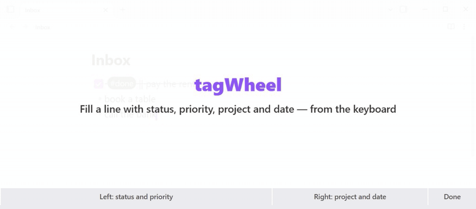

| Step | What you see |
|---|---|
| Left Block | `tagWheel Left` opens on Status: `↑` picks `#todo`, `→` steps to Priority, `↓` picks `#high` |
| Right Block | `tagWheel Right`: `↑` picks `Project A`, `→` steps to Due, `↑` is today |
| Done | Status, priority, project and date are in the line, as plain markdown |

## Fields and Values

A Field is one slot a line can carry, such as a status or a project. Its Values are what can fill it. Everything here is set in **Tags & PKM → Fields**.

### One Field and its Values

Show the clip

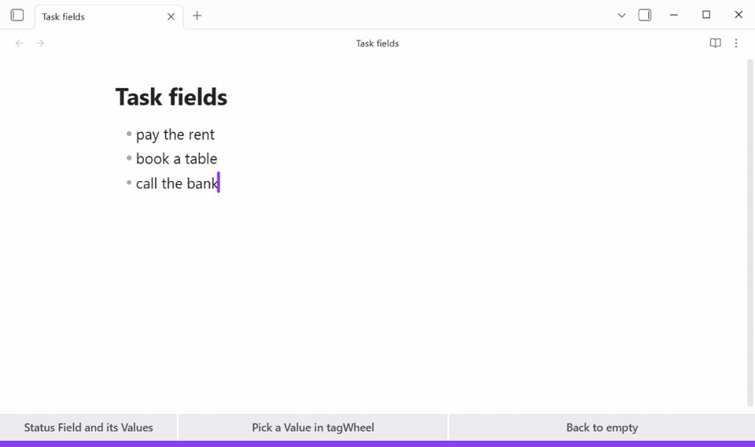

| Step | What you see |
|---|---|
| The Field | The panel opens on one Field, Status, with the Values `#todo`, `#doing`, `#done` |
| Pick a Value | `tagWheel Left` on `- call the bank`: `↑` `↑` `Enter` writes `- #doing \|\| call the bank` |
| Back to empty | `tagWheel Left` opens on `#doing`; the empty slot and `Enter` take the tag off the line |

### next and previous

Each Field gets two commands of its own. They change the Value with one key, without opening a panel.

Show the clip

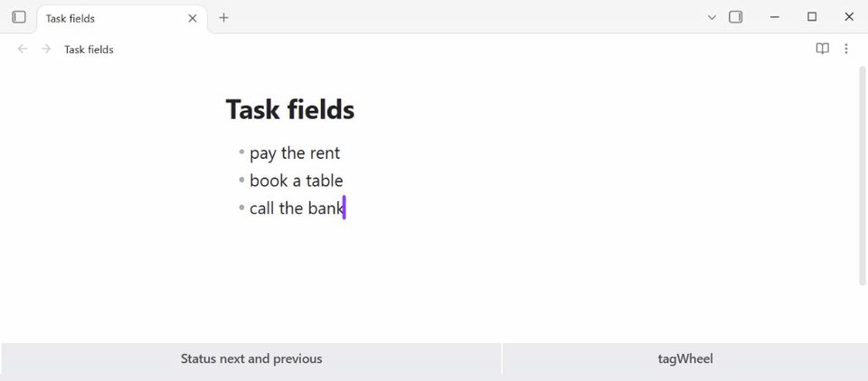

| Step | What you see |
|---|---|
| `Status next`, `Status previous` | The next Value with one key, then one step back |
| tagWheel | All Values of Status at once; `Enter` writes the one you picked |

### Hide a Value

The eye in front of a Value takes it out of `next`, `previous` and tagWheel; a line that already has it keeps it. **Tags & PKM → Fields → Values**.

Show the clip

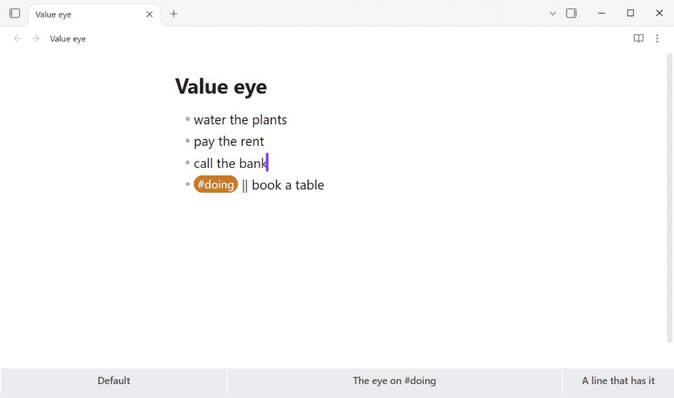

| Step | What you see |
|---|---|
| Default | tagWheel walks `#todo → #doing → #done` |
| The eye on `#doing` | tagWheel goes from `#todo` straight to `#done` |
| A line that has it | A line with `#doing` keeps it, and the next step goes on to `#done` |

### Add a Field

Show the clip

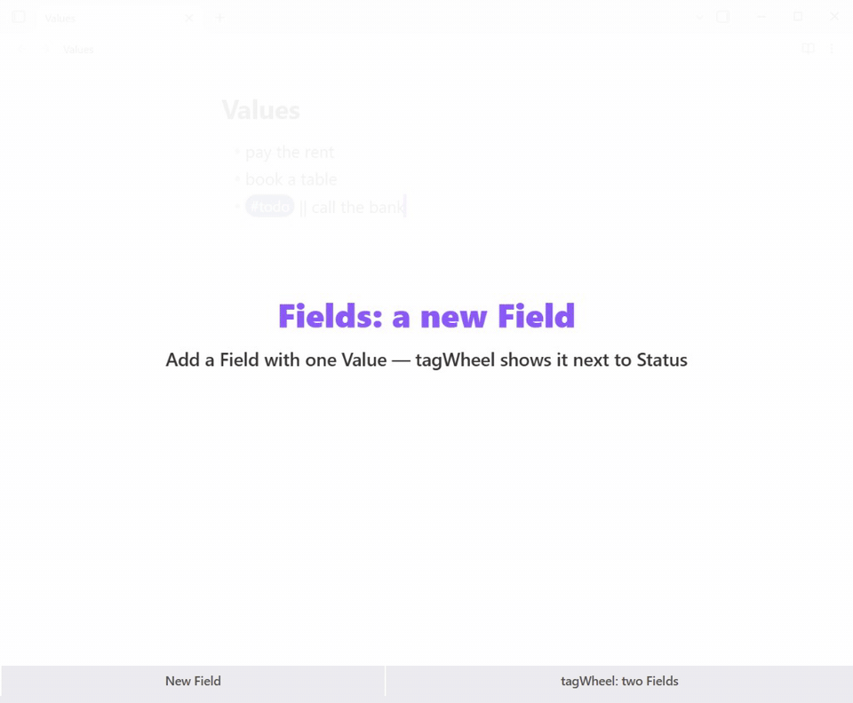

| Step | What you see |
|---|---|
| New Field | `Add Field`: the window offers `Tag`, `Link`, `Element`, `Action`; Energy, with one Value `#focus` |
| Picked at once | Energy is picked in the list, its Values on the right |
| Two Fields | `tagWheel Left` shows Status and Energy; `→` steps between them, `Enter` writes both Values |

### Dates, counters and your own lists

An Element writes an emoji marker with a Value after it, and `next` and `previous` step that Value. **Tags & PKM → Fields → Steps by**.

Show the clip

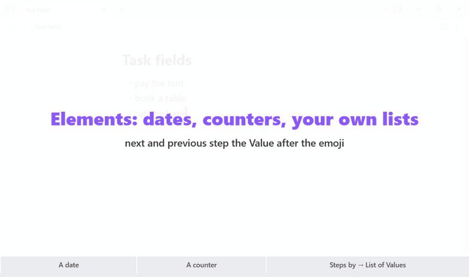

| Step | What you see |
|---|---|
| A date | `Due next` writes today, then steps `📅2026-10-07 → 📅2026-10-08` |
| A counter | `Value format` → `001`: `🔢001 → 🔢002` |
| `Steps by` → `List of Values` | `🙂‍↕️yes → 🙂‍↔️no` and back, each Value with its own emoji |

### Edit the line with an Action Field

An Action Field writes no Value: each of its categories is an edit of the line, with its own `next` and `previous`. **Tags & PKM → Fields → Add Field → Action**.

Show the clip

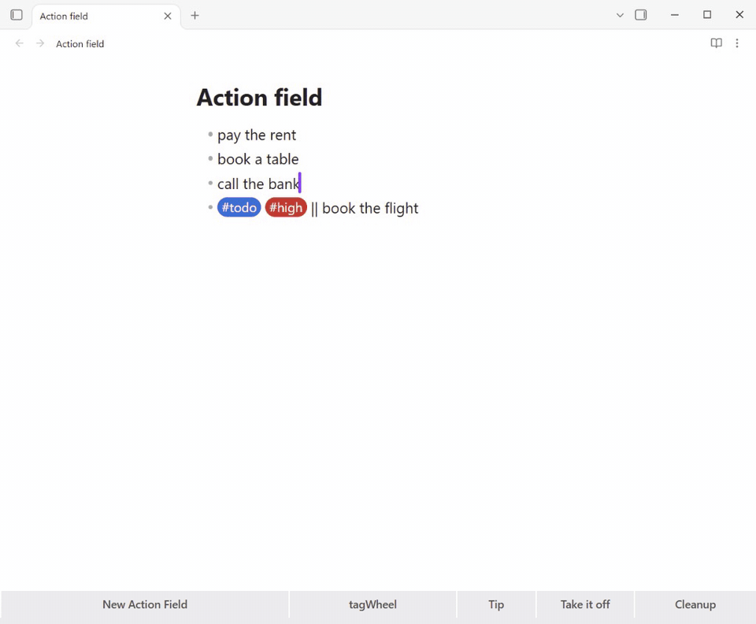

| Step | What you see |
|---|---|
| New Action Field | `Add Field` → `Action`, category `Insert callout` with its presets |
| tagWheel | `tagWheel Right` → `Insert callout` → `Note`: the line goes into a `> [!note]` callout |
| Tip | tagWheel opens on `Note`; `↑` picks `Tip` |
| Take it off | The empty slot takes the callout off |
| `Cleanup` | Another category: the Values leave the line, your text stays |

### Rename a link Value with its note

A link Value and its note keep one name. **Tags & PKM → Fields → Values**.

Show the clip

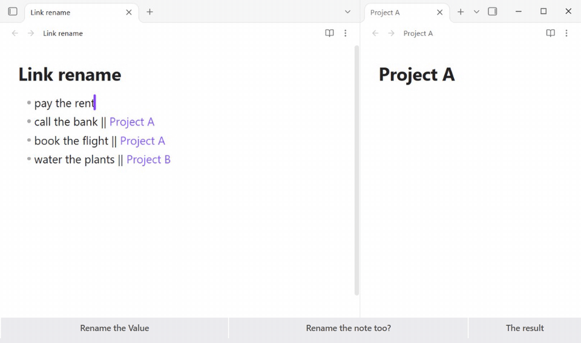

| Step | What you see |
|---|---|
| Rename the Value | `Project A` → `Project Atlas` in the Values table |
| `Rename the note too?` | The window counts the links in your notes; `Rename note and links`, and Obsidian may ask once more |
| The result | The note is `Project Atlas`, and every line that linked to it now says `[[Project Atlas]]` |

### Child Fields

A Field can depend on a Value of another one. **Tags & PKM → Fields → Child Field**.

Show the clip

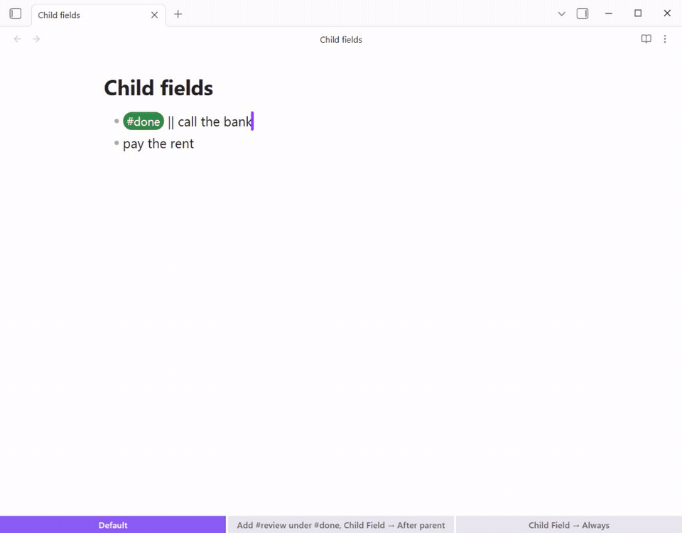

| Step | What you see |
|---|---|
| Two Fields | tagWheel has Status and Priority |
| `After parent` | `#review` added under `#done` is offered once the line has `#done` |
| `Always` | The child is offered on any line, with or without its parent |

### A child tag in one piece

`Child tag format` decides how a child Value is written next to its parent. **Tags & PKM → Fields → Behavior**.

Show the clip

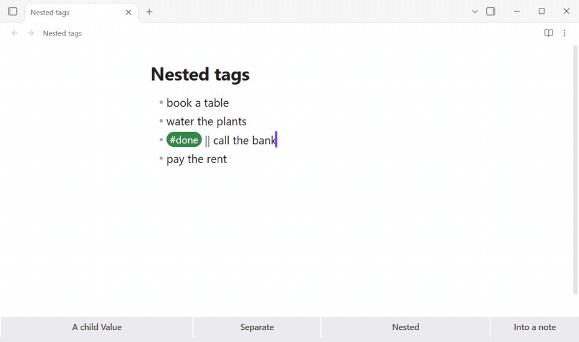

| Step | What you see |
|---|---|
| A child Value | `#review` goes under `#done` |
| `Separate` | Parent and child as two tags: `#done #review` |
| `Nested` | One tag: `#done/review` |
| Into a note | The floating button `→` turns the line into a note and writes `#done/review` to the property as one tag |

### A Field that waits for another

With `Prerequisite Field` a Field stays out of the line until another Field has a Value. **Tags & PKM → Fields → Behavior**.

Show the clip

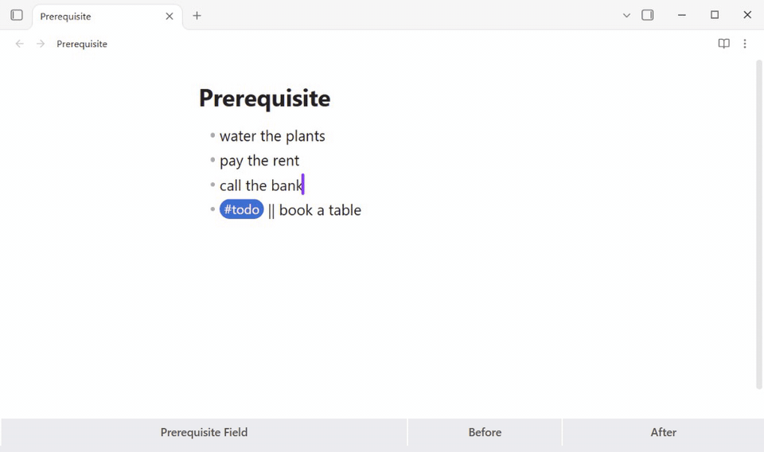

| Step | What you see |
|---|---|
| `Prerequisite Field` → `Yes`, waits for `Status` | In the line preview `Priority` turns pale, with `⬑Status` under it |
| Before | On a plain line tagWheel offers Status only |
| After | Once the line has a Status, tagWheel offers Priority too |

### Blocks and Separators

A line has a Left Block before your text and a Right Block after it, each closed off by a Separator. **Tags & PKM → Separators**.

Show the clip

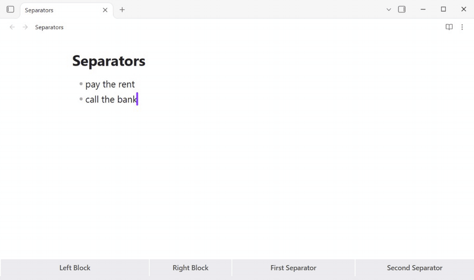

| Step | What you see |
|---|---|
| Left Block | Tags go before your text; the First Separator `\|\|` ends the block |
| Right Block | Links and dates go after your text; the Second Separator `\|\|` starts the block |
| Separators | Both changed to `::`, and the line follows |

### Change a Separator in every note

Lines written before a Separator change keep the old one. One button replaces it everywhere. **Tags & PKM → Separators**.

Show the clip

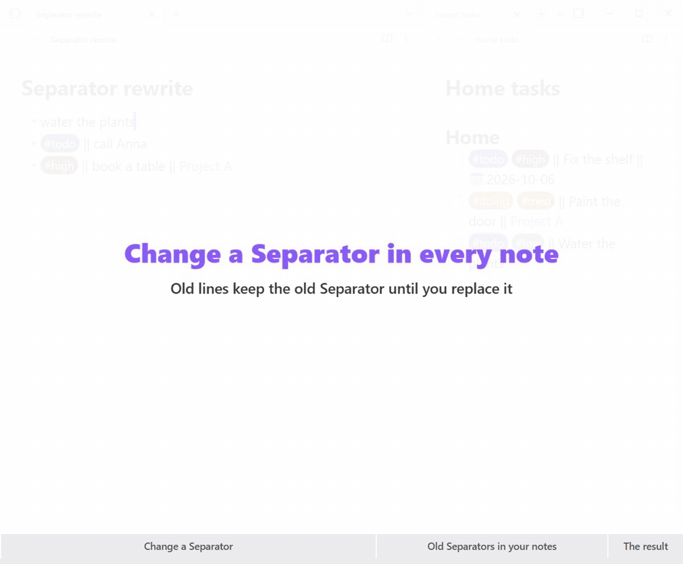

| Step | What you see |
|---|---|
| Change a Separator | `\|\|` → `::`; old lines still read `- #todo \|\| call Anna` |
| `Old Separators in your notes` | `Replace in all notes`: the window counts the lines and notes first |
| The result | Every old line now reads `- #todo :: call Anna`; the row goes away |

### A Block at the cursor

`Add Block` makes a Block of your own that writes where the cursor is, inside your text.

Show the clip

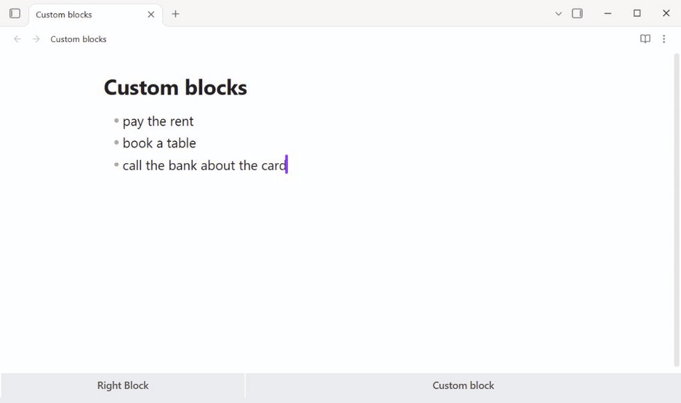

| Step | What you see |
|---|---|
| Right Block | Project sits in the Right Block, so the link goes after the text |
| Custom block | Project moves into `Custom block 1`; `tagWheel Custom block 1` writes the link at the cursor, and again on the link puts the next Value in its place |

### Where Values land

**Tags & PKM → Placement modes**.

Show the clip

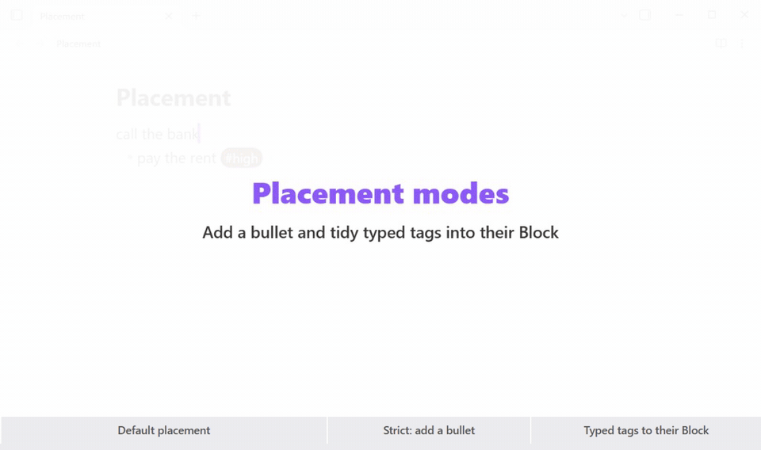

| Step | What you see |
|---|---|
| Default | `Status next` adds no bullet, and a tag you typed stays in your text |
| `Strict: add a bullet` | The line gets a bullet |
| `Keep typed tags in text` off | A typed `#high` moves into its Block |

### A Value that brings a checkbox

A Value can carry a line Prefix, such as `[ ]`. **Tags & PKM → Fields → Behavior → Prefix behavior**.

Show the clip

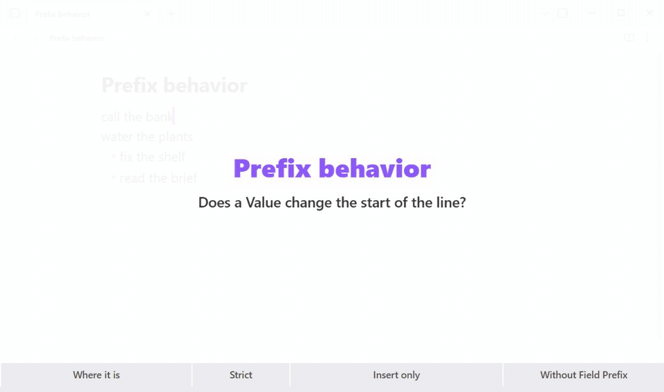

| Step | What you see |
|---|---|
| Where it is | `Prefix behavior` lives in each Field; `#todo` brings `[ ]` as its Prefix |
| `Strict` | Even a plain line gets the checkbox |
| `Insert only` | A plain line stays plain, a list line gets the checkbox |
| Without Field Prefix | `Insert only` with `use Field Prefix` off: the bullet stays, no checkbox |

### A mark for a ticked line

**Tags & PKM → Writing rules**.

Show the clip

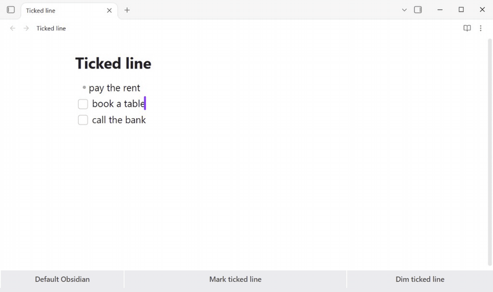

| Step | What you see |
|---|---|
| Default Obsidian | Ticking the box only checks it |
| `Mark ticked line` | Tick adds `#done`, untick takes it off |
| `Dim ticked line` | A ticked line fades |

## tagWheel

tagWheel opens over the line you are on. Arrow keys move between Fields and their Values, `Enter` writes the line back as plain markdown.

### How it moves

**Tags & PKM → tagWheel behavior**.

Show the clip

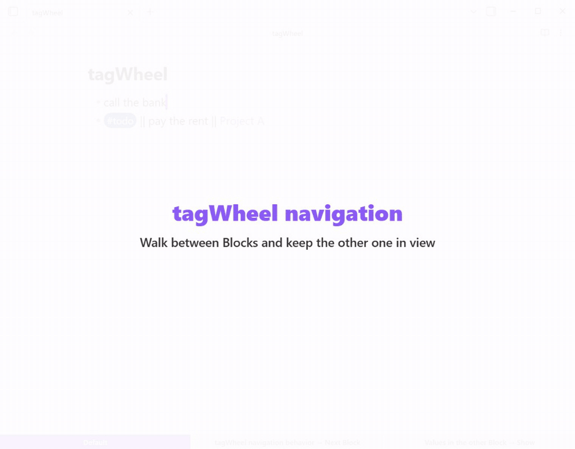

| Step | What you see |
|---|---|
| Default | `→` stays inside the Block; the other Block is hidden while you choose |
| `Next Block` | `→` walks on into the Right Block |
| `Values in the other Block` → `Show` | The other Block stays in view |

### The Field it opens on

Show the clip

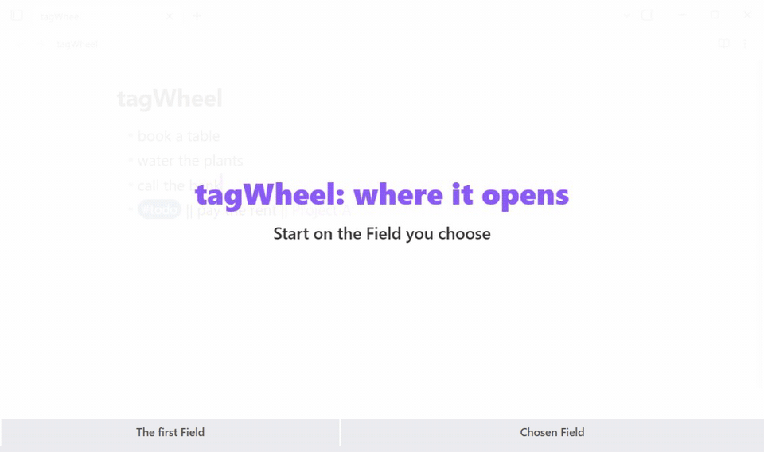

| Step | What you see |
|---|---|
| Default | Both `tagWheel Left` and `tagWheel Right` open on the first Field |
| `Active Field on opening` → `Chosen Field` | Left opens on Priority, Right on Project |

### Its look

**Visual → tagWheel → Panel** and **Scroller**.

Show the clip

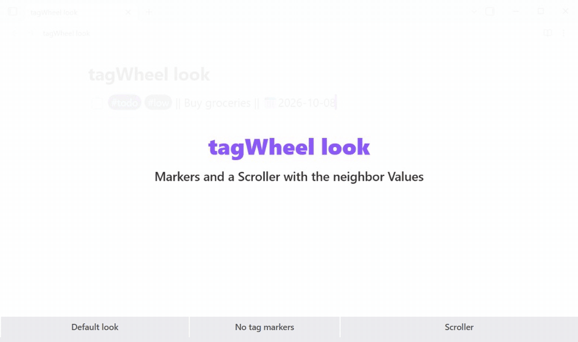

| Step | What you see |
|---|---|
| Default | The picker opens on the line; `Escape` puts the line back as it was |
| `Show tag markers` off | Values without the `#` |
| `Scroller` | Neighbor Values above and below; `↓` rolls to the next one |

### Its colors

Show the clip

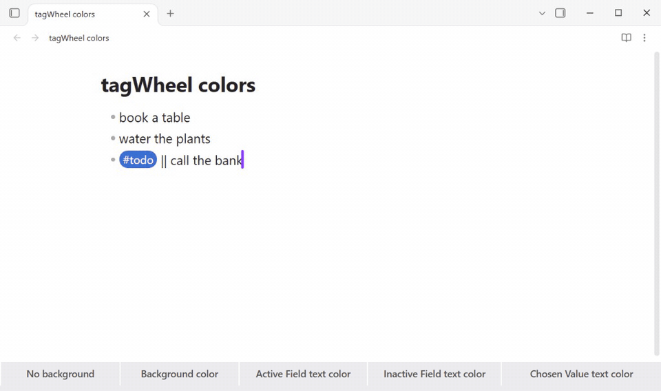

| Step | What you see |
|---|---|
| Default | The open line takes the highlight color of your theme |
| `Background color` | Your own color for the open line |
| Text colors | The Field you are on, the other Fields, and a Field that already has a Value, each in its own color |

## Moving and jumping

Eight commands that know a line has structure. **Navigation**.

### Move a line with its tree

**Navigation → Move lines (up/down)**.

Show the clip

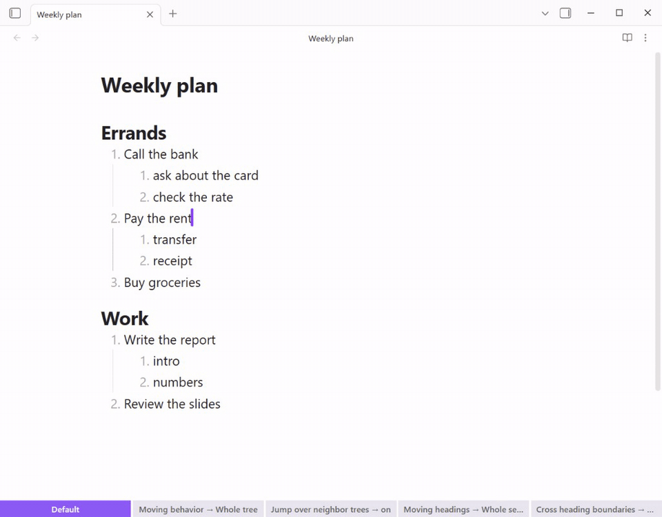

| Step | What you see |
|---|---|
| Default Obsidian | `Move line up` moves one line; its sub-items stay behind and the list breaks |
| `Whole tree` | The line takes its sub-items along |
| `Jump over neighbor trees` | It jumps over the whole neighbor |
| `Moving headings` → `Whole section` | The whole section moves |
| `Cross heading boundaries` off | It stops at its heading |

### Where the moved line ends up

Show the clip

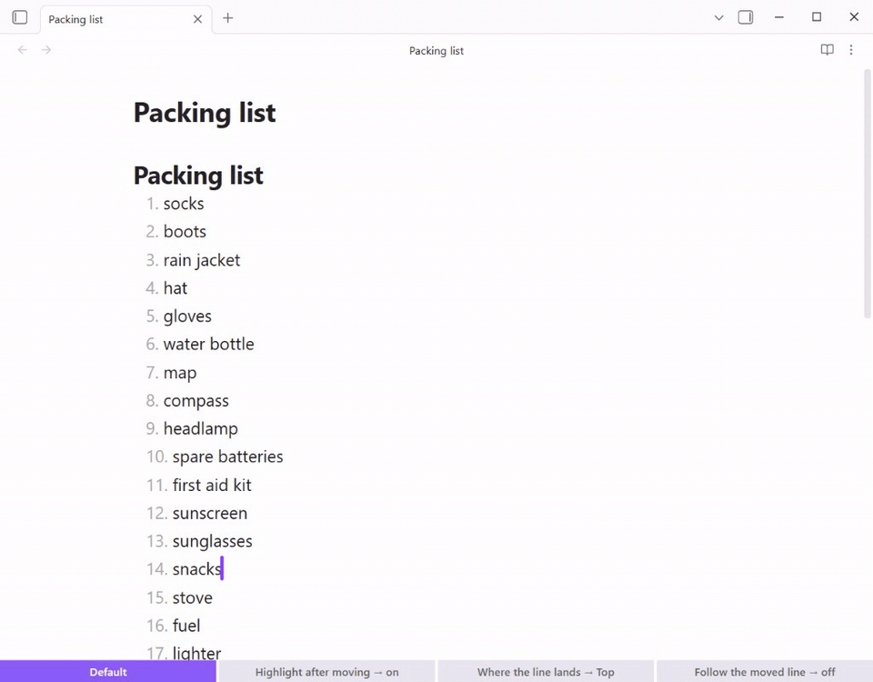

| Step | What you see |
|---|---|
| Default | The note scrolls to follow the moved line |
| `Highlight after moving` | The moved line stays highlighted |
| `Where the line lands` → `Top` | The line is kept at the top of the screen |
| `Follow the moved line` off | The note stays put |

### Move selected text

**Navigation → Move lines (left/right)**.

Show the clip

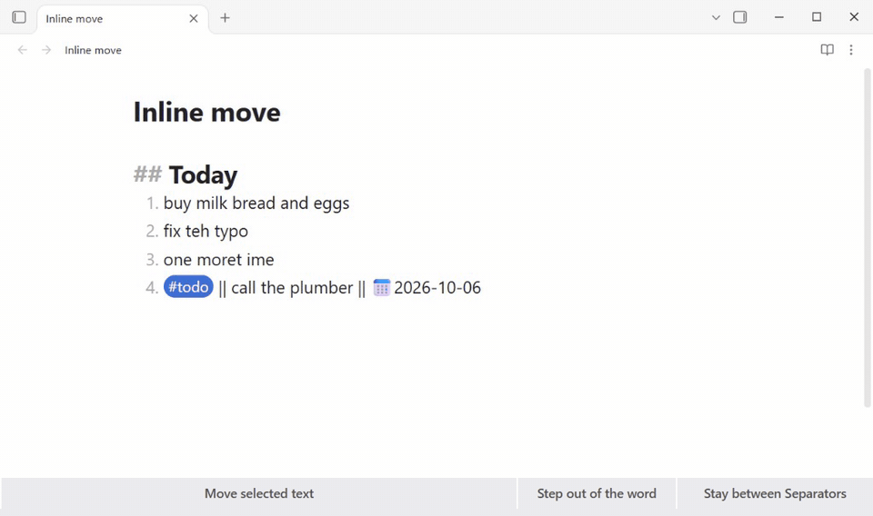

| Step | What you see |
|---|---|
| `Move selected text` | A selected word moves word by word, part of a word by letter, and can jump past the Separator |
| `Step out of the word` | The letter leaves its word |
| `Continue past Separators` off | The text stays between the Separators |

### Cycle the line marker

`Move left` and `Move right` on a line with no selection change its Prefix, then its indent.

Show the clip

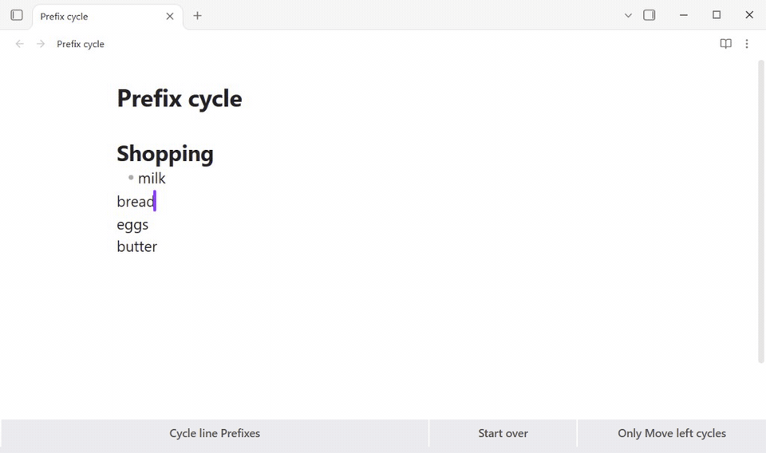

| Step | What you see |
|---|---|
| `Cycle line Prefixes` | Plain text becomes a bullet; with no marker left, it indents; `Move left` walks back |
| `After the last one` → `Start over` | After the bullet it starts over |
| `Cycle in both directions` off | Only `Move left` changes the marker |

### Jump inside a line

**Navigation → Jump inside a line (left/right)**.

Show the clip

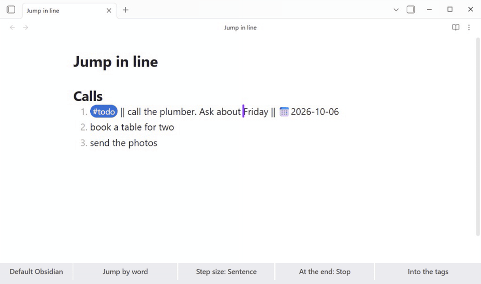

| Step | What you see |
|---|---|
| Default Obsidian | `Ctrl+→` walks on into the Separator and the date |
| `Jump right` | Word by word; at the end of your text it wraps back to its start |
| `Step size` → `Sentence` | To the end of each sentence |
| `What to do at the end` → `Stop` | The cursor stays put |
| `Continue past Separators` | `Jump left` walks into the tags |

### Jump inside a note

**Navigation → Jump inside a note (up/down)**.

Show the clip

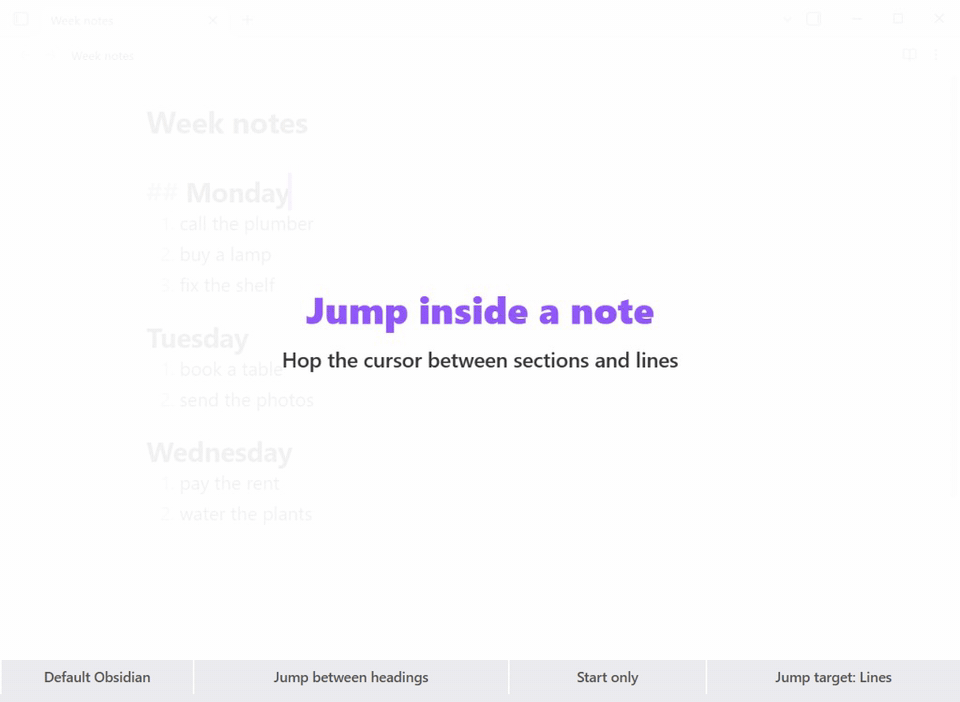

| Step | What you see |
|---|---|
| Default Obsidian | `↓` walks through every line |
| `Jump between headings` | `Jump down` stops at the end of a section, then at the start of the next |
| `Where in the section` → `Start only` | Only the first line of each section |
| `Jump target` → `Lines` | Line by line, headings included |

## Keyboard

Familiar keys that do a little more. **Keyboard**.

### Smart Ctrl+A

Show the clip

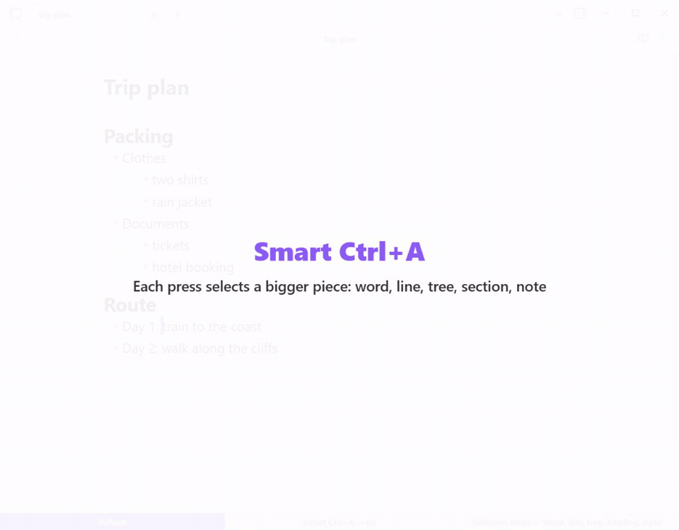

| Step | What you see |
|---|---|
| Default Obsidian | `Ctrl+A` selects the whole note |
| `Smart Ctrl+A` | The line first, then the whole note |
| `Selection steps` | Word, line, tree, section, note |

Show the clip

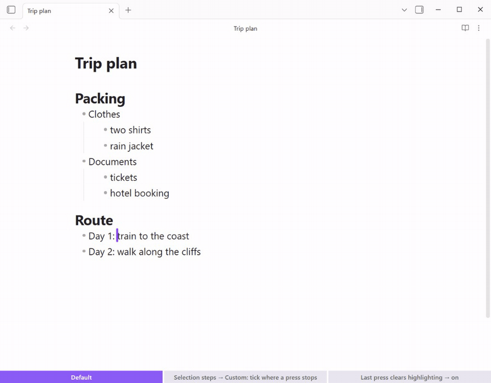

| Step | What you see |
|---|---|
| `Custom` | Tick the steps a press stops at: word, line, section, note |
| `Last press clears highlighting` | After the note, one more press lets go |

### Smart Delete and Backspace

Show the clip

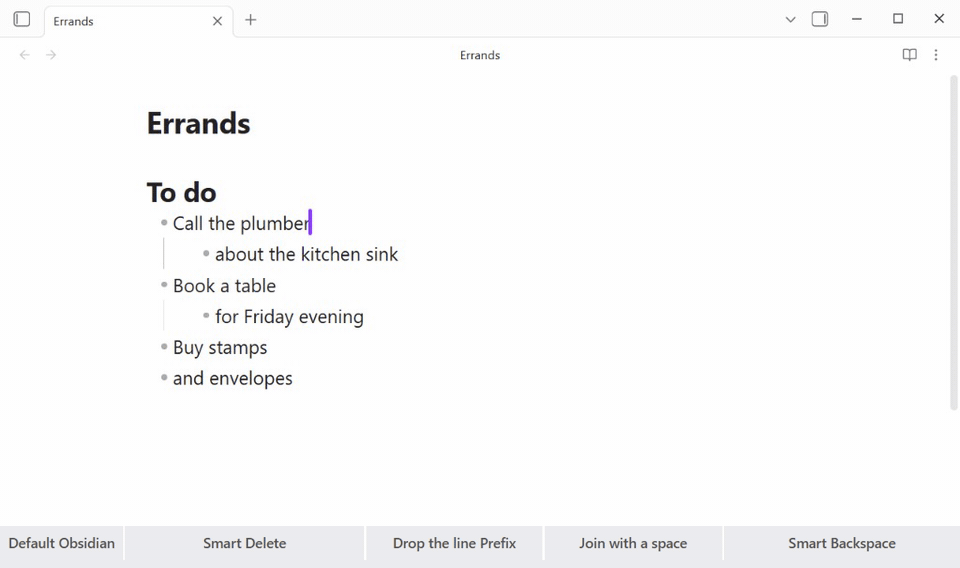

| Step | What you see |
|---|---|
| Default Obsidian | `Delete` pulls up the indent and the bullet too |
| `Smart Delete` | Only the indent goes |
| `Drop the line Prefix` | The bullet goes too |
| `Join with a space` | The words join with a space |
| `Smart Backspace` | `Backspace` at the start pulls the words up the same way |

### Smart Enter

Show the clip

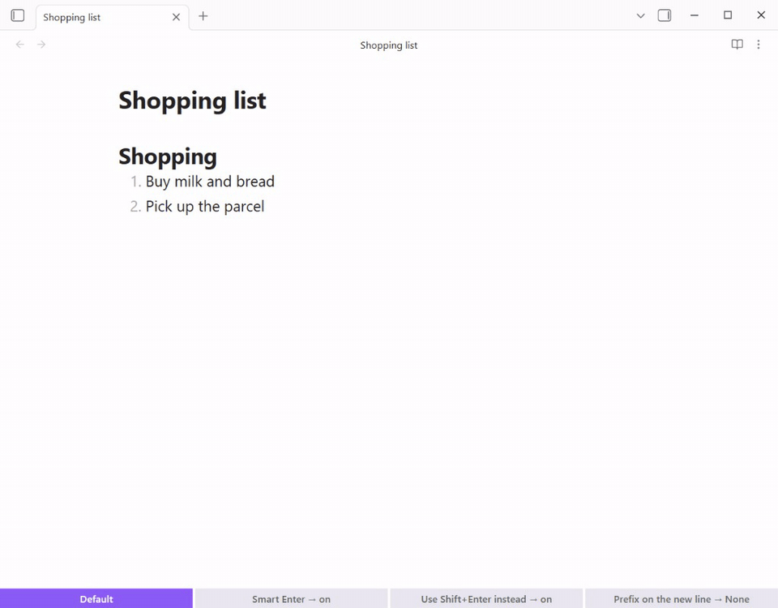

| Step | What you see |
|---|---|
| Default Obsidian | `Enter` splits the line |
| `Smart Enter` | A new line below, this one stays whole, the new line takes the same marker |
| `Prefix on the new line` | `None`: the new line starts bare. `Numbered lines only`: the next number, but no bullet |
| `Use Shift+Enter instead` | `Enter` splits as usual, `Shift+Enter` adds the line below |

### Smart paste

Show the clip

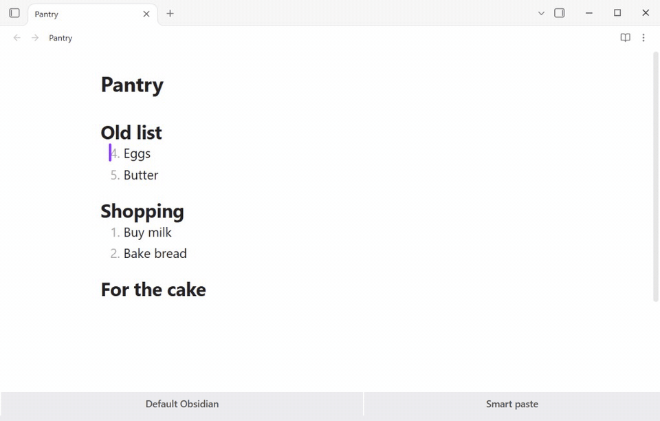

| Step | What you see |
|---|---|
| Default Obsidian | Pasted on its own, a numbered list keeps its old numbers |
| `Smart paste` | Under a list the count carries on; on its own it starts from one |

### Binder: your own insert commands

**Keyboard → Binder**.

Show the clip

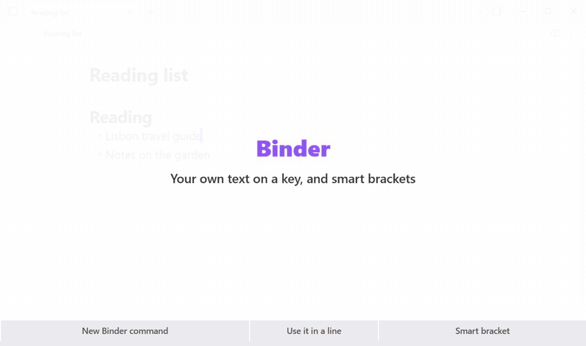

| Step | What you see |
|---|---|
| New command | A row inserts `→`; the name fills itself in |
| Use it | Its key drops `→` in at the cursor |
| `Smart bracket` | `[text]`, then `[[text]]`, then back; works on a selection too |

### Commands and hotkeys

**Keyboard → Commands & Hotkeys**.

Show the clip

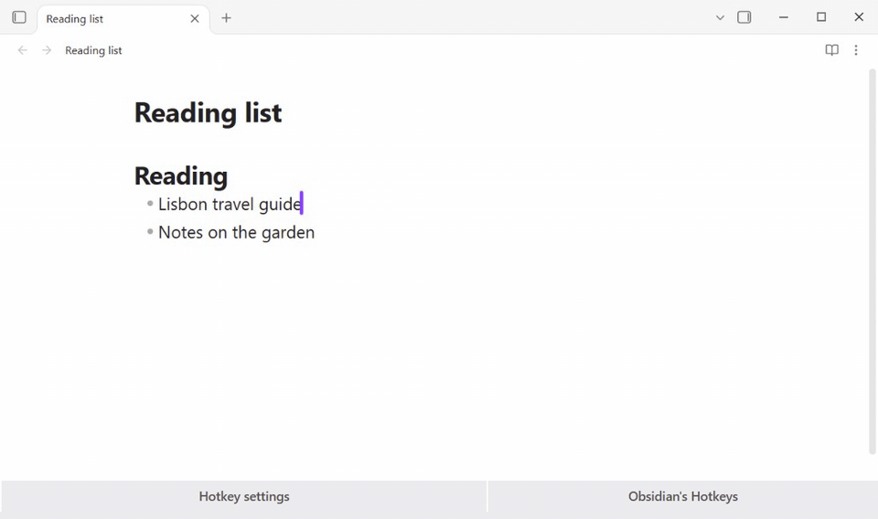

| Step | What you see |
|---|---|
| The list | Every command of the plugin with its hotkey; a command with no key shows an empty slot |
| `to hotkeys` | Opens Obsidian's `Hotkeys` filtered to that group |

## Transform

`Transform inline to note` turns the line you are on into a note. **Transform**. It writes real files, so try it on notes you can afford to lose.

### A line becomes a note

Show the clip

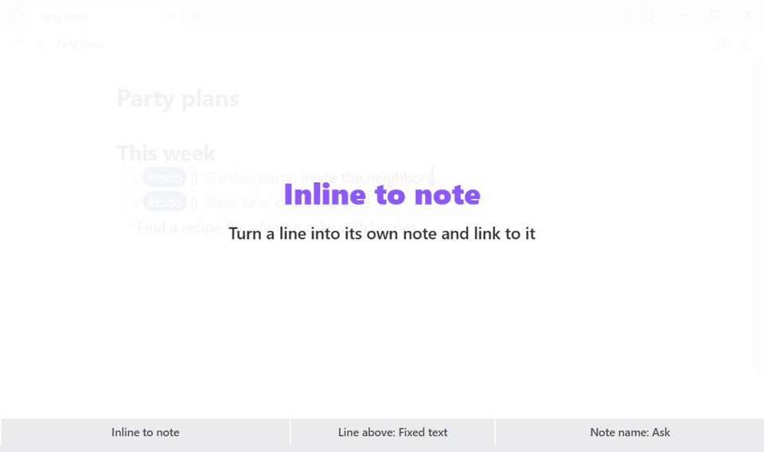

| Step | What you see |
|---|---|
| `Inline to note` | The floating button turns the line into a note named from its `[brackets]`; the line now links to it |
| `Line above the text` → `Fixed text` | The note starts with your fixed text, not the date |
| `Note name` → `Ask` | You type the name yourself |

### What stays behind

**Transform → Source line**.

Show the clip

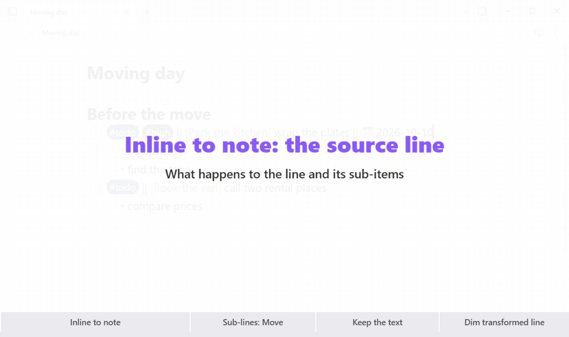

| Step | What you see |
|---|---|
| Default | The line becomes a link, its sub-items stay |
| `Sub-lines (tree) behavior` → `Move` | The sub-items go into the note too |
| `What happens with current line` → `Keep` | The text stays next to the link |
| `Dim transformed line` | The handled line fades |

### A template per line

**Transform → Smart Rules**.

Show the clip

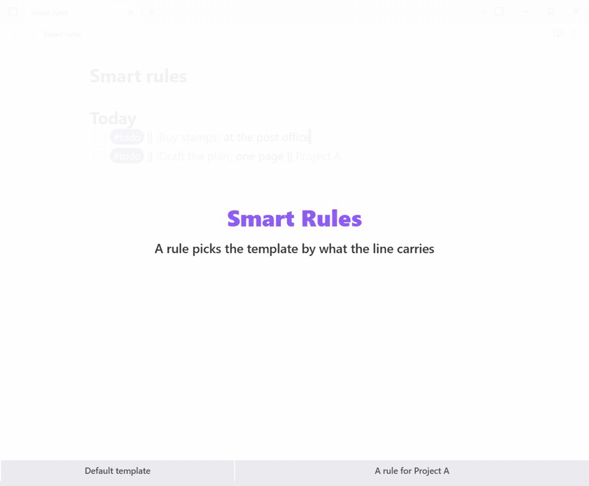

| Step | What you see |
|---|---|
| Default | Every line becomes a note from the default template |
| A rule | A line with `[[Project A]]` gets the `Project task` template |

### Links back to the notes you mention

**Transform → Auto-MOC in your links**.

Show the clip

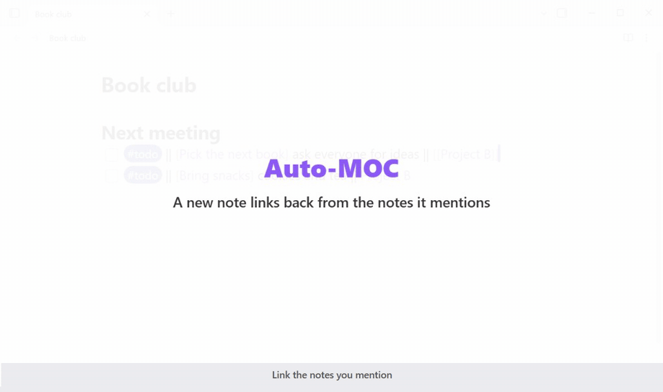

| Step | What you see |
|---|---|
| `Link the notes you mention` | The new note mentions Project B, and Project B gets a link to it at the end |
| `Where to put the link` → `Beginning` | The link goes to the top of Project B |
| `Under heading` | The link joins the `## Meetings` section |
| `If heading not found` | The heading is added at the top, the link under it |

Show the clip

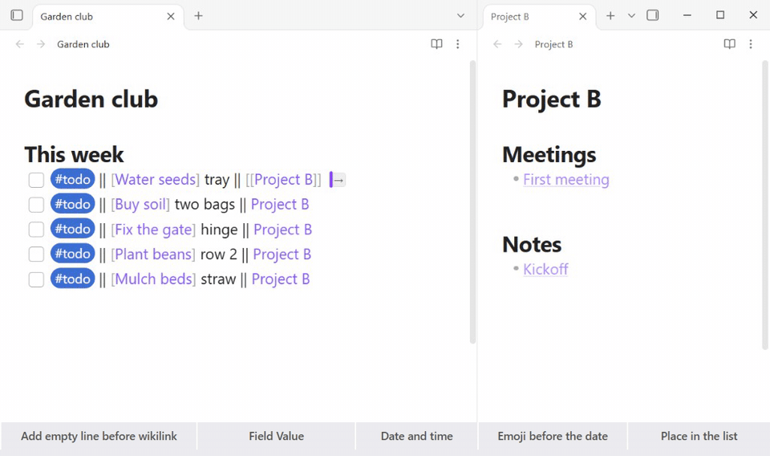

| Step | What you see |
|---|---|
| `Add empty line before wikilink` off | The link comes with no blank line |
| `Add after the link` → `Field Value` | The link carries the Due date |
| `Add after the link` → `Date and time` | The link carries the moment of the Transform |
| `Emoji before the date` | The date gets its mark, such as `➕` |
| `Place in the list` → `Top` | The newest link goes first |

## Visual

Drawing only: the file on disk stays the same. **Visual**.

### Tags, Blocks and the Stripe

**Visual → Inline appearance**, its `Line view` and `Tag view` parts.

Show the clip

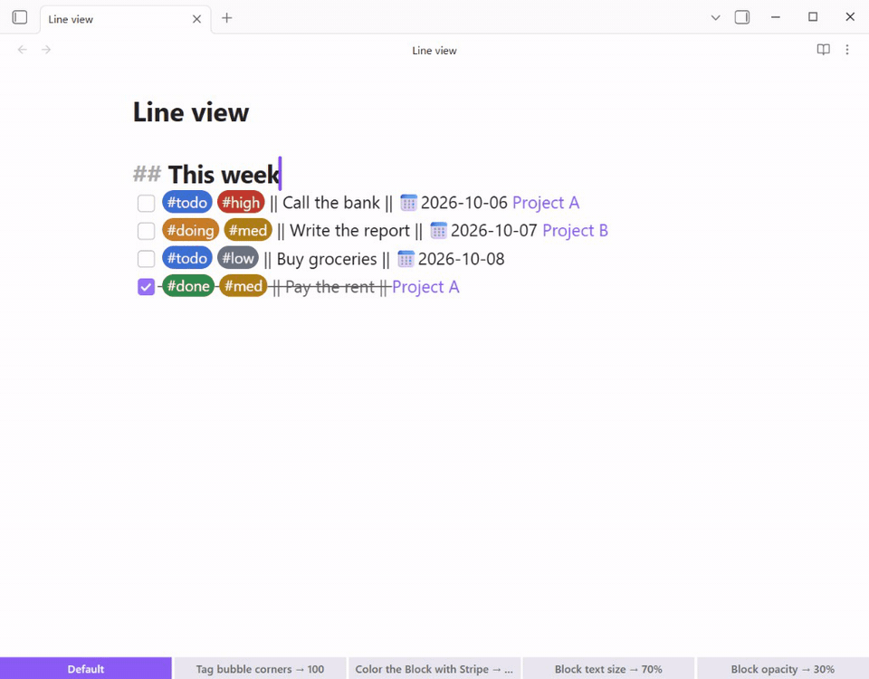

| Step | What you see |
|---|---|
| `Tag bubble corners` | Tag bubbles turn square |
| `Left Block text size`, `Right Block text size` | Both Blocks get smaller, your text stays |
| `Opacity of the Left Block`, `Opacity of the Right Block` | Both Blocks fade, your text stands out |
| `Color the Block with Stripe` | A faint Stripe runs behind each Block |
| `Stripe opacity` | The Stripe gets stronger |

### Link colors

**Visual → Inline appearance**, its `Link view` part.

Show the clip

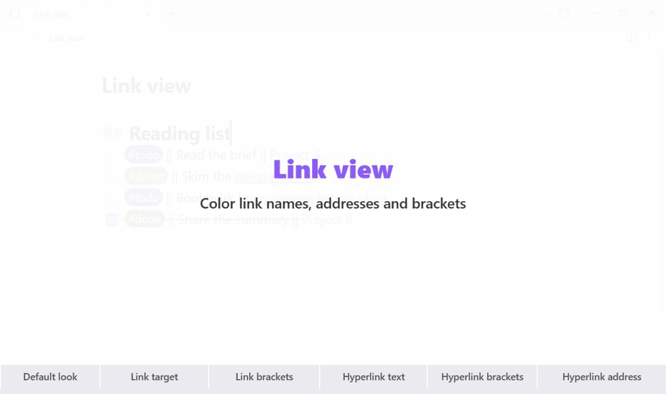

| Step | What you see |
|---|---|
| Wikilinks | `Link target color` paints the note name, `Link brackets color` the `[[ ]]` on the cursor line |
| Markdown links | `Hyperlink target color` paints the text, `Hyperlink brackets color` the `[ ] ( )` |
| Addresses | `Hyperlink address color` paints every web address |

### Tag Bars

A Bar in the margin, in the color of a tag, down a line and everything nested under it. **Visual → Tag Bars**.

Show the clip

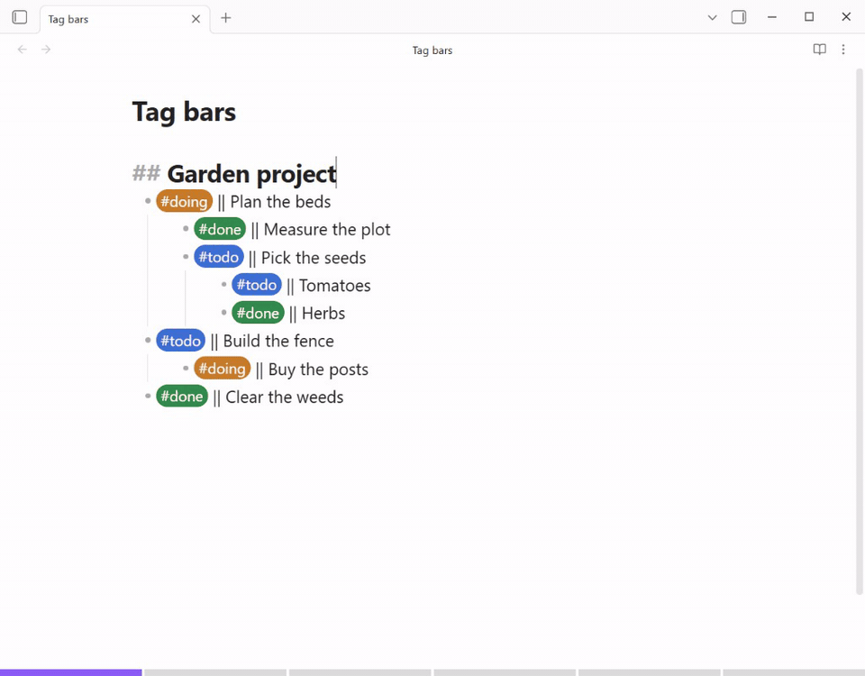

| Step | What you see |
|---|---|
| `Tag Bars`, drawn by Status | A Bar in the tag's color runs down each tree |
| `Number of Bars` | The third level gets its own Bar |
| `Show the Field's tag` off | The Bar speaks for the tag |
| `Bars for the whole tree` off | Each Bar covers only its own line |
| `Join Bars in a tree` off | Parent and child Bars break apart |

Show the clip

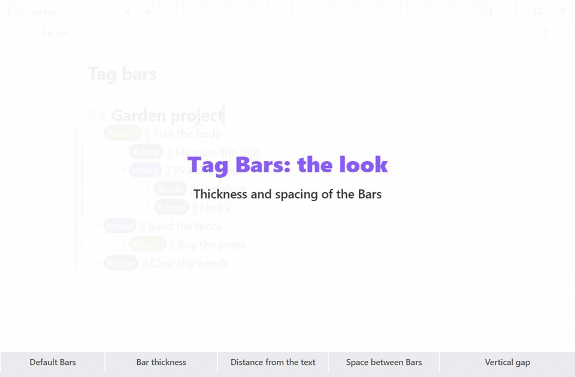

| Step | What you see |
|---|---|
| `Bar thickness` | The Bars get wider |
| `Distance from the text` | The Bars move away from the lines |
| `Space between Bars` | The levels spread apart |
| `Vertical gap between Bars` | Each Bar gets a gap above and below |

### Colors for your own tags

For tags that are not a Value of any Field. **Visual → Color custom tags**.

Show the clip

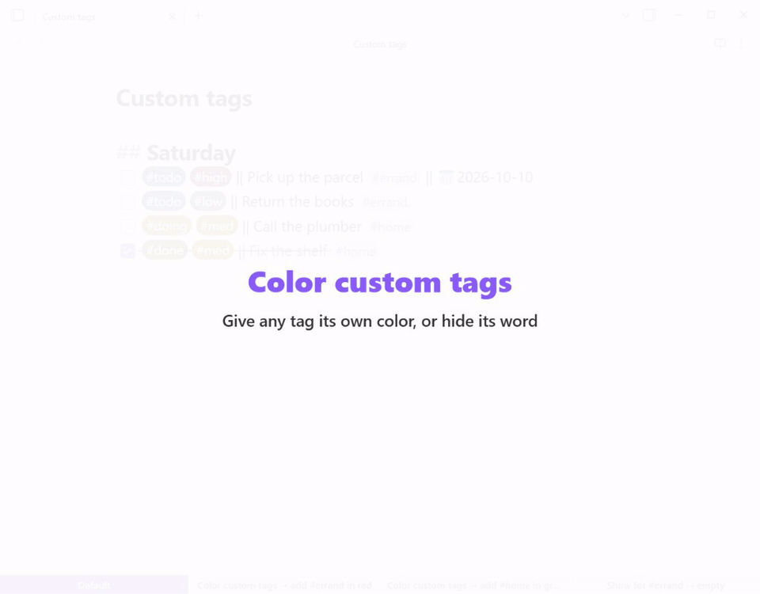

| Step | What you see |
|---|---|
| A color per tag | Every `#errand` gets a red bubble, every `#home` a green one |
| `Show` empty | `#errand` keeps its color, the word is hidden |

### The text cursor

**Visual → Text cursor** and **Cursor jump highlight**.

Show the clip

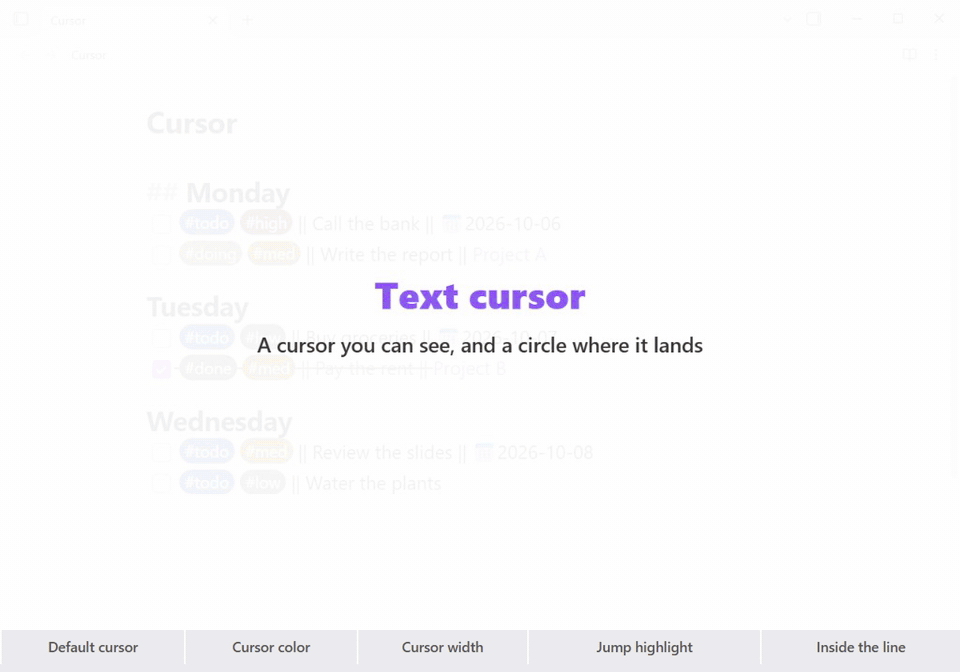

| Step | What you see |
|---|---|
| `Color the text cursor` | The cursor is red |
| `Shape the text cursor` | A 6 px cursor, hard to lose |

Show the clip

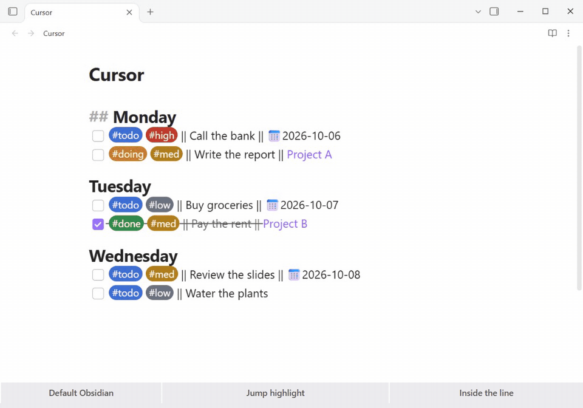

| Step | What you see |
|---|---|
| Default Obsidian | After `Jump down` it is hard to see where the cursor landed |
| `Highlight where you land` | A circle marks the spot |
| `Use inside current line` | The circle shows on jumps inside the line too |

## Settings and safety

### Modules

Each area of the plugin switches off on its own. **General → Modules**.

Show the clip

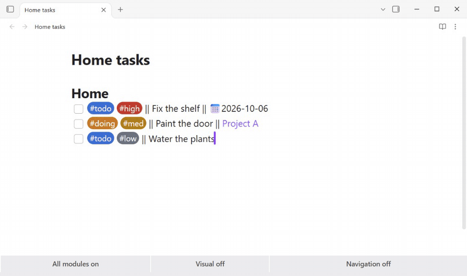

| Step | What you see |
|---|---|
| Default | All four modules on |
| `Visual` off | The note goes back to the look of your theme |
| `Navigation` off | `Move up` moves nothing, and the plugin says the module is off |

### Backup

**Advanced → Backup**.

Show the clip

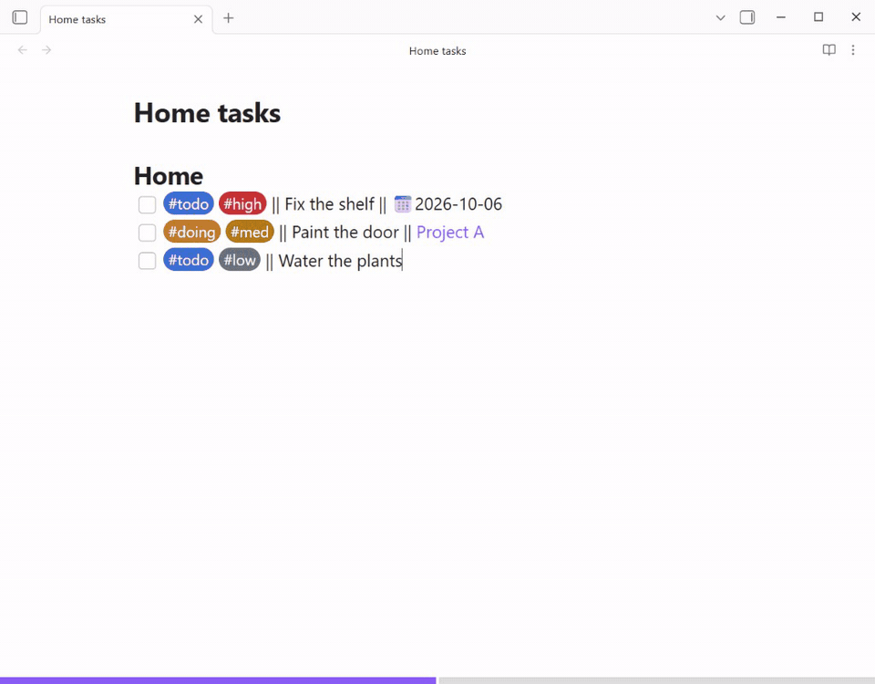

| Step | What you see |
|---|---|
| `Save a backup` | Your settings as a note in your vault; pick the tabs to keep |
| `Restore a backup` | Backups listed newest first |
| `Autosave` | A fresh copy each time Obsidian starts with changed settings |

### Undo a settings change

The command `Undo last settings change`, and the tips of **Advanced → Diagnostics**.

Show the clip

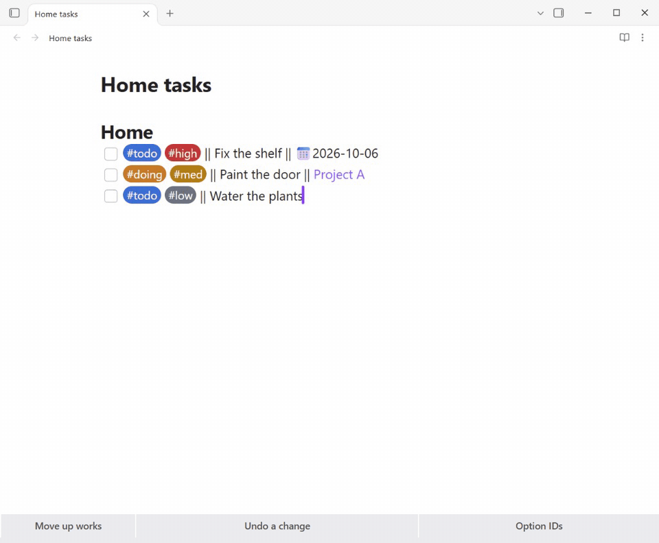

| Step | What you see |
|---|---|
| `Undo last settings change` | Navigation switched off by mistake comes back, and `Move up` works again |
| `Show option IDs in tips` | Each tip ends with the identifier of its setting |
