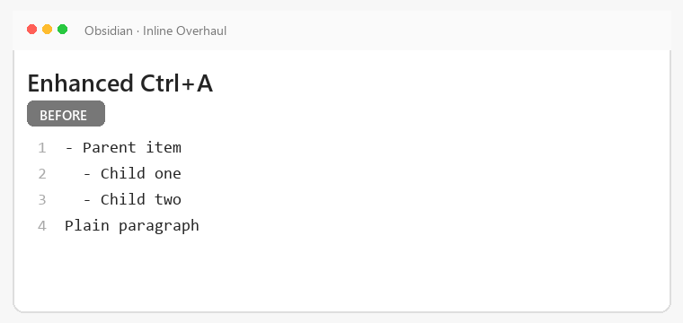
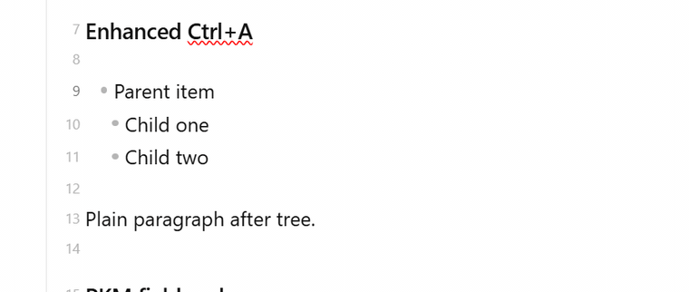
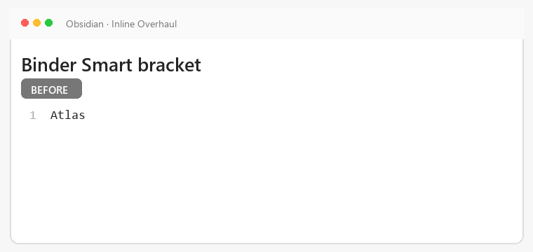
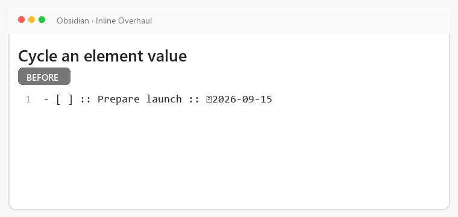
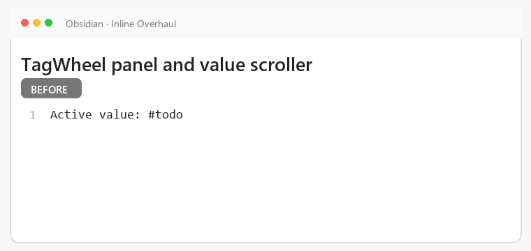

# inlineOverhaul Showcase

This showcase covers part of the public feature surface as grouped user workflows; the complete surface is listed in [`FEATURES.md`](FEATURES.md). `move-lines.gif`, `prefix-cycle.gif`, `pkm-cycle.gif`, and `tagwheel.gif` are live Obsidian captures; the other GIFs are animated behavior diagrams grounded in the runtime. Command hotkeys in captions are configurable; Enhanced Mod+A uses fixed `Ctrl/Cmd+A`.

See the [full setup and user guide](instructions.md) for installation, configuration, Transform safety, copyable examples, and troubleshooting.

## What is here and what is not

> [!IMPORTANT]
> **Seventeen entries were removed on 2026-09-11**, by the author's decision.
> Their animations showed the settings pane as it was before the rebuild: seven
> areas instead of tabs with sub-tabs, no visibility toggles, one Fields editor
> instead of the Order board and its Deep Editor. A picture of a pane that no
> longer exists misleads exactly the reader this file is written for — someone
> who has not installed the plugin yet.
>
> **The GIF files themselves were not deleted.** They are the author's material
> and stay in `media/showcase/`; when the pane is re-recorded, the entries come
> back with them.
>
> **The features did not go anywhere.** What each removed entry showed is
> described in words in [`README.md`](README.md) and in the
> [user guide](instructions.md); the links that pointed at the removed entries
> are now plain headings there, not dead anchors.

**Runtime behavior did not change** — moving lines, cycling Values, TagWheel.
What changed is the settings pane and the names of commands.

**Every command was renamed**, and its identifier with it, so a caption naming a
command by its old name is wrong: `Navigation: Move Up` is now `Move line up`,
`Transform: inline2note` is now `Transform inline to note`, `PKM: <field>
increase` is now `<Field> next`. The full map is in
[`docs/command_ids_v1_v2.md`](docs/command_ids_v1_v2.md).

### Captions still worth a second look

Two entries keep their picture and have a stale caption: `navigation-header-jump`
and `pkm-cycle` name commands by their old names. The pictures hold — the
behavior they show did not change.

### Headings are link targets

Headings here are link targets from `README.md`. Renaming one breaks a link, so
nothing is renamed in place: an entry either stays as it is or goes, and when it
goes, the `README.md` link becomes plain text in the same commit. A pin in
`tests/regression/docs_terms_tests.ts` checks this in both directions.

## Table of contents

- [General](#general)
  - [Enhanced Ctrl+A](#enhanced-ctrla)
- [Navigation](#navigation)
  - [Move lines/trees](#move-linestrees)
  - [Move selected inline text](#move-selected-inline-text)
  - [Prefix cycle/indent fallback](#prefix-cycleindent-fallback)
  - [Header jumps](#header-jumps)
  - [Inline PKM zone navigation](#inline-pkm-zone-navigation)
- [Binder](#binder)
  - [Smart bracket](#smart-bracket)
- [PKM design/config](#pkm-designconfig)
- [PKM runtime](#pkm-runtime)
  - [Direct tag/link field cycle increase/decrease](#direct-taglink-field-cycle-increasedecrease)
  - [Element increment/decrement](#element-incrementdecrement)
  - [TagWheel left/right/navigation/apply/cancel](#tagwheel-leftrightnavigationapplycancel)
- [Visual](#visual)
  - [TagWheel panel/scroller](#tagwheel-panelscroller)
- [Transform Inline2Note](#transform-inline2note)
  - [Current root or selected tree](#current-root-or-selected-tree)
  - [YAML Raw/Clean mapping](#yaml-rawclean-mapping)

## General

### Enhanced Ctrl+A

Expand selection from the current line to its indentation tree and then the whole note.

*Typical hotkey: press `Ctrl+A` repeatedly in the editor.*

## Navigation

### Move lines/trees

Move the active line or its indentation tree without cutting and pasting.

*Typical hotkeys: `Ctrl+Shift+Up` and `Ctrl+Shift+Down`.*

### Move selected inline text

Shift selected text left or right while keeping the rest of the line intact.

*Typical action: select inline text, then run **Navigation: Move Left** or **Navigation: Move Right**.*

### Prefix cycle/indent fallback

Cycle configured structural prefixes and apply the configured cycle-end or indentation fallback.

*Typical hotkeys: `Ctrl+Shift+Left` and `Ctrl+Shift+Right`.*

### Header jumps

Jump to the previous or next Markdown header without leaving the editor.

*Typical action: run **Navigation: Jump Header Up** or **Navigation: Jump Header Down**.*

### Inline PKM zone navigation

Move the cursor between configured inline PKM zones on the active line.

*Typical action: run **Navigation: Inline Left** or **Navigation: Inline Right**.*

## Binder

### Smart bracket

Insert or cycle context-aware bracket forms around the cursor or selected text.

*Typical action: run **Binder: Smart bracket** from a configured hotkey.*

## PKM design/config

## PKM runtime

### Direct tag/link field cycle increase/decrease

Cycle the active tag or link field forward or backward through its configured values.

*Typical action: run generated **PKM: `<name_strict>` increase/decrease** commands. The demo vault uses `Alt+Up` for one increase command; bindings are configurable.*

### Element increment/decrement

Increase or decrease supported generic, date, time, and number elements in place.

*Typical action: place the cursor on an element, then run its increase or decrease command from configured hotkeys.*

### TagWheel left/right/navigation/apply/cancel

Open TagWheel, move across fields and values, apply a choice, or cancel without changes.

*Typical action: open with `Alt+Down`, navigate with arrow keys, apply with `Enter`, or cancel with `Escape`.*

## Visual

### TagWheel panel/scroller

Display TagWheel fields and values in a panel with scrolling for larger configurations.

*Typical action: open TagWheel from its configured hotkey and scroll through available entries.*

## Transform Inline2Note

The Transform module defaults on, but the separate Inline2Note execution gate defaults off. Read the [full Transform instructions](instructions.md) before enabling execution.

### Current root or selected tree

> [!CAUTION]
> Test in a sandbox vault or back up affected notes before transforming a root or selected tree.

Choose the current root tree or an explicit editor selection as the transform source.

*Typical action: place the cursor in a root or select a tree, then run `Transform: inline2note` from a configured hotkey.*

### YAML Raw/Clean mapping

> [!CAUTION]
> Test in a sandbox vault or back up affected notes before writing mapped values into target frontmatter.

Map recognized inline fields into template/target frontmatter using Raw or Clean values.

*Typical action: choose **YAML note format → Raw/Clean**, then run `Transform: inline2note`; its hotkey is configurable.*
