# inlineOverhaul Showcase

This showcase covers the complete public feature surface as 30 grouped user workflows. `move-lines.gif`, `prefix-cycle.gif`, `pkm-cycle.gif`, and `tagwheel.gif` are live Obsidian captures; the other GIFs are animated behavior diagrams grounded in the runtime. Command hotkeys in captions are configurable; Enhanced Mod+A uses fixed `Ctrl/Cmd+A`.

See the [full setup and user guide](instructions.md) for installation, configuration, Transform safety, copyable examples, and troubleshooting.

## What is out of date

> [!IMPORTANT]
> **The settings pane was rebuilt, and most animations below predate it.** Nothing
> here has been re-recorded: the GIFs are the author's material. This section says
> which entries no longer match the plugin, so that a reader is not misled and the
> re-recording list is written down rather than remembered.
>
> Runtime behavior — moving lines, cycling Values, TagWheel — did not change. What
> changed is the settings pane and the names of commands.

**Two changes affect almost everything below.**

1. **The settings pane is new**: seven areas instead of tabs with sub-tabs, no
   visibility toggles, one Fields editor instead of the Order board and its Deep
   Editor. Any frame showing plugin settings shows a pane that no longer exists.
2. **Every command was renamed**, and its identifier with it, so captions naming a
   command are wrong: `Navigation: Move Up` is now `Move line up`,
   `Transform: inline2note` is now `Transform inline to note`, `PKM: <field>
   increase` is now `<Field> next`. The full map is in
   [`docs/command_ids_v1_v2.md`](docs/command_ids_v1_v2.md).

### Captions that name something removed or renamed (16 of 30)

Proven by reading the text, not the picture.

| Entry | What the caption still says |
|---|---|
| Open settings and module toggles | `General: Open settings` — the command is **gone**, removed 2026-09-06; open the pane the normal Obsidian way |
| Settings undo/flush | `Flush Settings Now` — control removed; the undo button is gone, the command remains |
| Enhanced Ctrl+A | setting is now `Expanded 'Ctrl+A'` and lives under Keyboard |
| Move selected inline text | old Navigation command names |
| Smart bracket | `Binder: Smart bracket` is now `Smart bracket` |
| Deep Editor hierarchy | Deep Editor is now the right column of the Fields editor |
| Separators/prefix resolver/cursor/free-roam policies | `prefix resolver` is now Prefix priority; `free roam` is now placement modes |
| Generate/apply portable Markdown config | old Config command names |
| Direct tag/link field cycle increase/decrease | `PKM: <name_strict> increase/decrease` is now `<Field> next/previous` |
| Hierarchy Strip/token hiding | Hierarchy Strip is now Tag Bars, and it is off by default |
| Synthetic preview/opt-in | old Transform command name |
| Current root or selected tree | old Transform command name |
| Templates/Smart Rules/auto-manual naming | old Transform command name |
| Collision/body/header policies | old Transform command name |
| YAML Raw/Clean mapping | `YAML note format` — control removed; the rule now lives on each Value |
| Source cleanup/link/processed token/sublines/open target | processed token is now the Processed marker |

### Animations that show the settings pane (17 of 30)

These need re-recording whatever their captions say, because the pane itself is
different. Judged by what each entry claims to show — the pictures themselves were
not inspected.

`general-modules.gif`, `general-settings-history.gif`, `general-diagnostics.gif`,
`pkm-field-order.gif`, `pkm-deep-editor.gif`, `pkm-value-dependencies.gif`,
`pkm-elements.gif`, `pkm-yaml-mapping.gif`, `pkm-line-policy.gif`,
`pkm-config-workflow.gif`, `binder-custom-command.gif`,
`visual-tag-bubbles.gif`, `visual-strip.gif`, `transform-preview.gif`,
`transform-routing-naming.gif`, `transform-collisions.gif`,
`transform-source-processing.gif`

### Animations that are probably still right (8 of 30)

Editor behavior only, no settings pane in frame, and nothing renamed in the
caption. Four of them are live Obsidian captures.

`move-lines.gif`, `prefix-cycle.gif`, `pkm-cycle.gif`, `tagwheel.gif` (live
captures), `navigation-header-jump.gif`, `navigation-inline-zones.gif`,
`pkm-element-cycle.gif`, `visual-tagwheel-scroller.gif`

Two of these have stale captions even though the picture holds:
`navigation-header-jump.gif` and `pkm-cycle.gif` name commands by their old names.

### What this file is not

Headings here are link targets from `README.md`. Renaming them would break those
links, so nothing was renamed. When the animations are re-recorded, entry titles
and README links move together, in one commit.

## Table of contents

- [General](#general)
  - [Open settings and module toggles](#open-settings-and-module-toggles)
  - [Settings undo/flush](#settings-undoflush)
  - [Diagnostics/developer logs](#diagnosticsdeveloper-logs)
  - [Enhanced Ctrl+A](#enhanced-ctrla)
- [Navigation](#navigation)
  - [Move lines/trees](#move-linestrees)
  - [Move selected inline text](#move-selected-inline-text)
  - [Prefix cycle/indent fallback](#prefix-cycleindent-fallback)
  - [Header jumps](#header-jumps)
  - [Inline PKM zone navigation](#inline-pkm-zone-navigation)
- [Binder](#binder)
  - [Custom insertion commands](#custom-insertion-commands)
  - [Smart bracket](#smart-bracket)
- [PKM design/config](#pkm-designconfig)
  - [Field schema/order/panels](#field-schemaorderpanels)
  - [Deep Editor hierarchy](#deep-editor-hierarchy)
  - [Per-value prefixes/dependencies](#per-value-prefixesdependencies)
  - [Generic elements/date/time/number](#generic-elementsdatetimenumber)
  - [YAML field mapping](#yaml-field-mapping)
  - [Separators/prefix resolver/cursor/free-roam policies](#separatorsprefix-resolvercursorfree-roam-policies)
  - [Generate/apply portable Markdown config](#generateapply-portable-markdown-config)
- [PKM runtime](#pkm-runtime)
  - [Direct tag/link field cycle increase/decrease](#direct-taglink-field-cycle-increasedecrease)
  - [Element increment/decrement](#element-incrementdecrement)
  - [TagWheel left/right/navigation/apply/cancel](#tagwheel-leftrightnavigationapplycancel)
- [Visual](#visual)
  - [Tag bubbles/per-value styles/separator colors](#tag-bubblesper-value-stylesseparator-colors)
  - [TagWheel panel/scroller](#tagwheel-panelscroller)
  - [Hierarchy Strip/token hiding](#hierarchy-striptoken-hiding)
- [Transform Inline2Note](#transform-inline2note)
  - [Synthetic preview/opt-in](#synthetic-previewopt-in)
  - [Current root or selected tree](#current-root-or-selected-tree)
  - [Templates/Smart Rules/auto-manual naming](#templatessmart-rulesauto-manual-naming)
  - [Collision/body/header policies](#collisionbodyheader-policies)
  - [YAML Raw/Clean mapping](#yaml-rawclean-mapping)
  - [Source cleanup/link/processed token/sublines/open target](#source-cleanuplinkprocessed-tokensublinesopen-target)

## General

### Open settings and module toggles

Open the plugin settings the normal Obsidian way — **Settings → Community plugins → inlineOverhaul** — then enable or disable each feature module without changing unrelated settings.

> The `General: Open settings` command shown in the recording no longer exists. It was removed on 2026-09-06: it relied on Obsidian's private `app.setting` API, which is a standard community-review objection. The heading above is kept because `README.md` links to it.

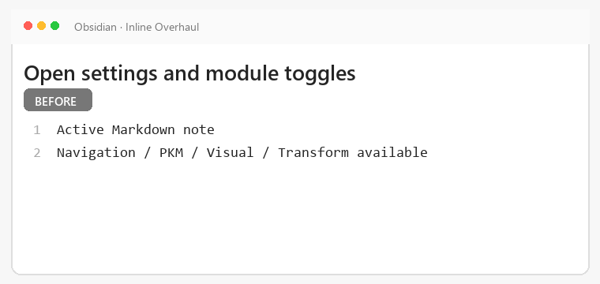

*Typical action: open plugin settings and toggle a module; settings actions do not require a hotkey.*

### Settings undo/flush

Settings autosave. Undo the latest session mutation or force pending state to disk with **Advanced → Flush Settings Now → Flush**.

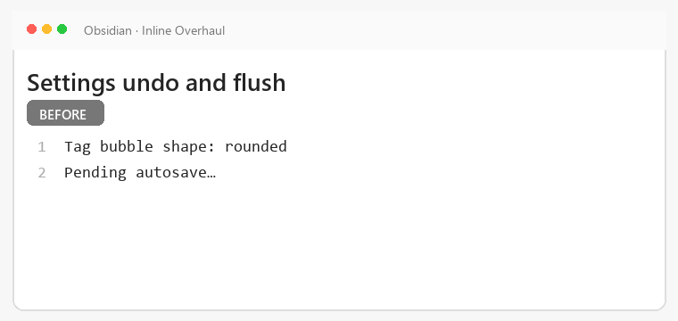

*Typical action: use **General: Undo last settings change** or **Flush Settings Now**.*

### Diagnostics/developer logs

Inspect diagnostics and enable developer logging for focused troubleshooting. Logs may contain complete before/after note lines; review them before sharing and disable Dev Mode afterward.

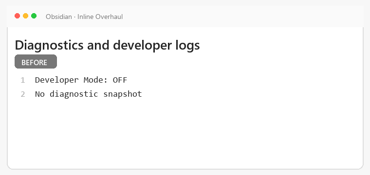

*Typical action: open Diagnostics in plugin settings; log collection does not require a hotkey.*

### Enhanced Ctrl+A

Expand selection from the current line to its indentation tree and then the whole note.

*Typical hotkey: press `Ctrl+A` repeatedly in the editor.*

## Navigation

### Move lines/trees

Move the active line or its indentation tree without cutting and pasting.

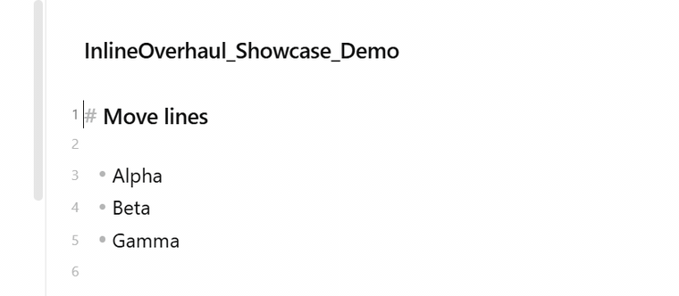

*Typical hotkeys: `Ctrl+Shift+Up` and `Ctrl+Shift+Down`.*

### Move selected inline text

Shift selected text left or right while keeping the rest of the line intact.

*Typical action: select inline text, then run **Navigation: Move Left** or **Navigation: Move Right**.*

### Prefix cycle/indent fallback

Cycle configured structural prefixes and apply the configured cycle-end or indentation fallback.

*Typical hotkeys: `Ctrl+Shift+Left` and `Ctrl+Shift+Right`.*

### Header jumps

Jump to the previous or next Markdown header without leaving the editor.

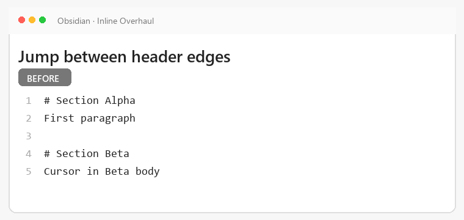

*Typical action: run **Navigation: Jump Header Up** or **Navigation: Jump Header Down**.*

### Inline PKM zone navigation

Move the cursor between configured inline PKM zones on the active line.

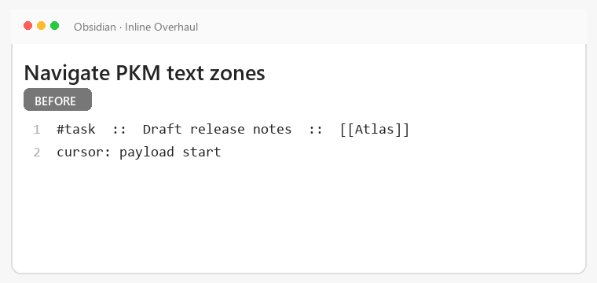

*Typical action: run **Navigation: Inline Left** or **Navigation: Inline Right**.*

## Binder

### Custom insertion commands

Turn user-defined text snippets into dedicated insertion commands.

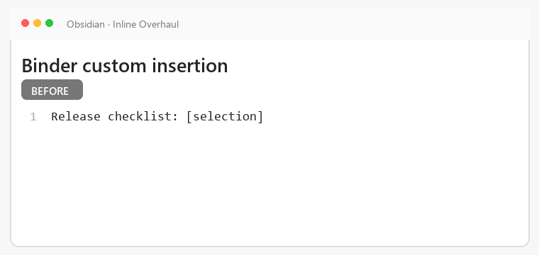

*Typical action: invoke a custom Binder insertion command from its configured hotkey.*

### Smart bracket

Insert or cycle context-aware bracket forms around the cursor or selected text.

*Typical action: run **Binder: Smart bracket** from a configured hotkey.*

## PKM design/config

### Field schema/order/panels

Define fields, arrange their runtime order, and place them in TagWheel panels.

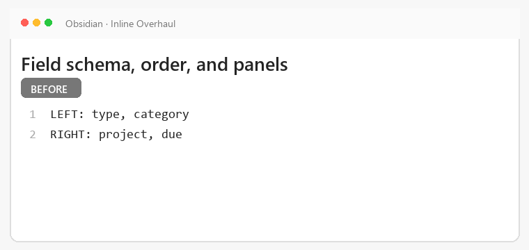

*Typical action: edit fields and order in PKM settings; configuration does not require a hotkey.*

### Deep Editor hierarchy

Edit nested values and parent-child relationships in the Deep Editor.

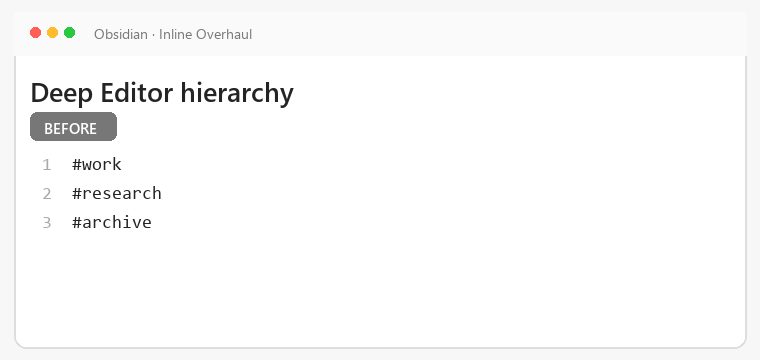

*Typical action: open Deep Editor for a field in PKM settings; configuration does not require a hotkey.*

### Per-value prefixes/dependencies

Assign value-specific prefixes and dependencies that constrain related choices.

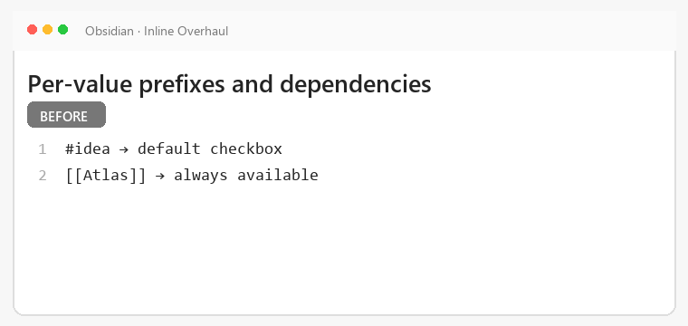

*Typical action: edit a value's prefix and dependency settings; configuration does not require a hotkey.*

### Generic elements/date/time/number

Define reusable generic, date, time, and number elements for inline lines.

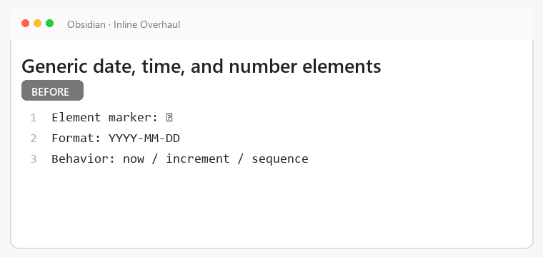

*Typical action: add or edit an element in PKM settings; configuration does not require a hotkey.*

### YAML field mapping

Map configured inline fields to YAML properties used by notes and transforms.

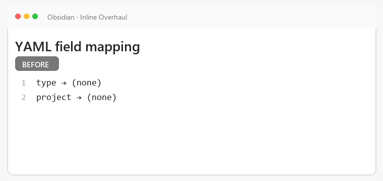

*Typical action: assign YAML property names in PKM settings; configuration does not require a hotkey.*

### Separators/prefix resolver/cursor/free-roam policies

Control separators, prefix resolution, post-action cursor placement, and free-roam behavior.

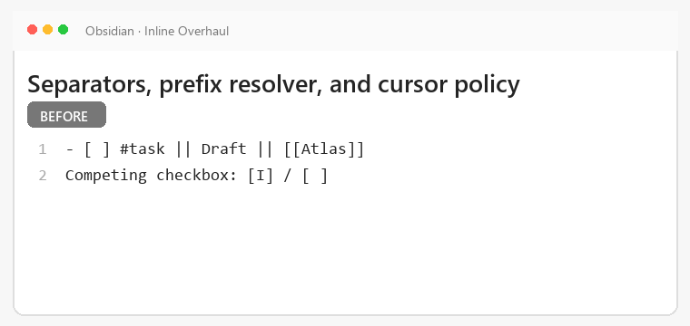

*Typical action: choose line and cursor policies in PKM settings; configuration does not require a hotkey.*

### Generate/apply portable Markdown config

Generate a Markdown configuration and apply it to reproduce a PKM setup in another vault.

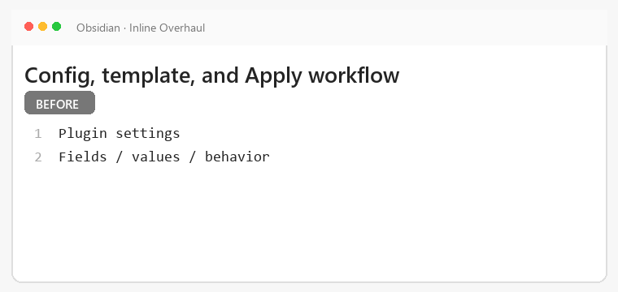

*Снято 2026-09-03: конфиг-заметки в плагине больше нет. Копию всех настроек пишет `Advanced → Settings backup`, гифка осталась как история.*

## PKM runtime

### Direct tag/link field cycle increase/decrease

Cycle the active tag or link field forward or backward through its configured values.

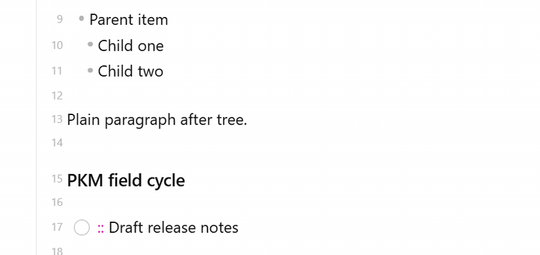

*Typical action: run generated **PKM: `<name_strict>` increase/decrease** commands. The demo vault uses `Alt+Up` for one increase command; bindings are configurable.*

### Element increment/decrement

Increase or decrease supported generic, date, time, and number elements in place.

*Typical action: place the cursor on an element, then run its increase or decrease command from configured hotkeys.*

### TagWheel left/right/navigation/apply/cancel

Open TagWheel, move across fields and values, apply a choice, or cancel without changes.

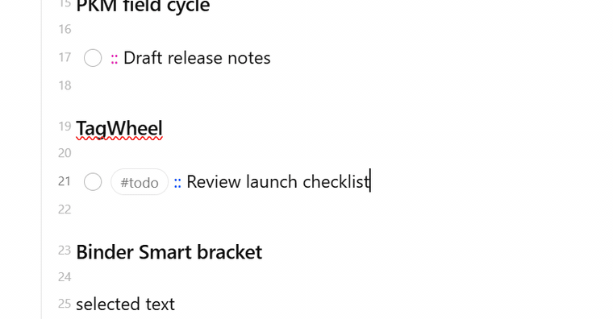

*Typical action: open with `Alt+Down`, navigate with arrow keys, apply with `Enter`, or cancel with `Escape`.*

## Visual

### Tag bubbles/per-value styles/separator colors

Render inline tags as bubbles with value-specific styles and colored separators.

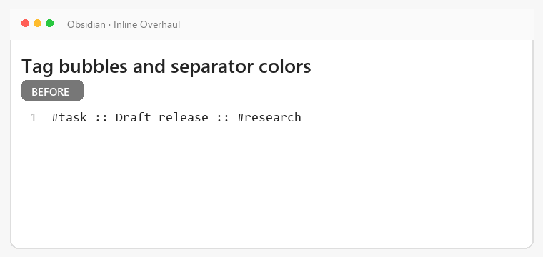

*Typical action: configure Visual styles, then view a matching inline line; no runtime hotkey is required.*

### TagWheel panel/scroller

Display TagWheel fields and values in a panel with scrolling for larger configurations.

*Typical action: open TagWheel from its configured hotkey and scroll through available entries.*

### Hierarchy Strip/token hiding

Show hierarchy context in a compact strip while optionally hiding the configured Strip field token and its separator.

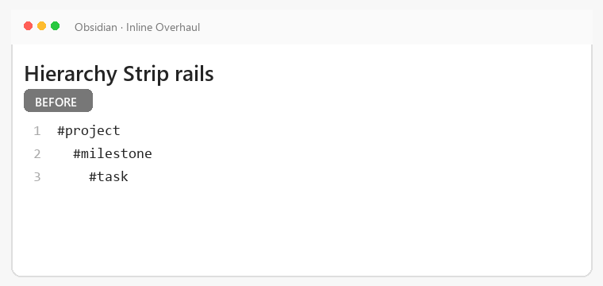

*Typical action: enable Hierarchy Strip or token hiding in Visual settings; no runtime hotkey is required.*

## Transform Inline2Note

The Transform module defaults on, but the separate Inline2Note execution gate defaults off. Read the [full Transform instructions](instructions.md) before enabling execution.

### Synthetic preview/opt-in

> [!CAUTION]
> Test in a sandbox vault or back up affected notes before enabling Inline2Note execution.

Review the settings-only synthetic Before/After source-processing example before opting in. Running **Transform: inline2note** after opt-in mutates immediately; there is no per-run confirmation preview.

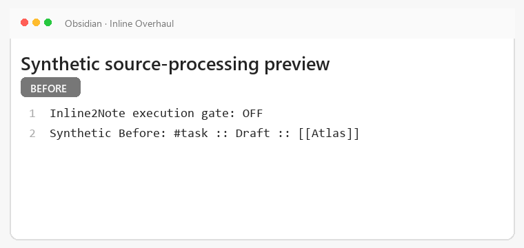

*Typical action: inspect the Transform settings preview, review every policy, then enable the execution gate only in a sandbox.*

### Current root or selected tree

> [!CAUTION]
> Test in a sandbox vault or back up affected notes before transforming a root or selected tree.

Choose the current root tree or an explicit editor selection as the transform source.

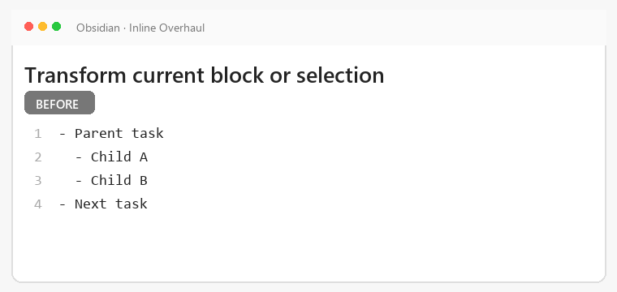

*Typical action: place the cursor in a root or select a tree, then run `Transform: inline2note` from a configured hotkey.*

### Templates/Smart Rules/auto-manual naming

> [!CAUTION]
> Test in a sandbox vault or back up affected notes before applying routing, templates, or naming rules.

Route output through templates and Smart Rules with automatic or prompted note names.

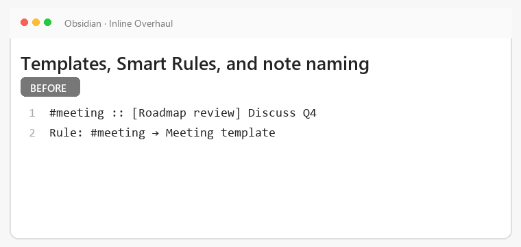

*Typical action: configure routing and naming, then run `Transform: inline2note`; its hotkey is configurable.*

### Collision/body/header policies

> [!CAUTION]
> Test in a sandbox vault or back up affected notes before applying collision, body, or header policies.

Choose how Inline2Note handles existing targets, generated bodies, and headers.

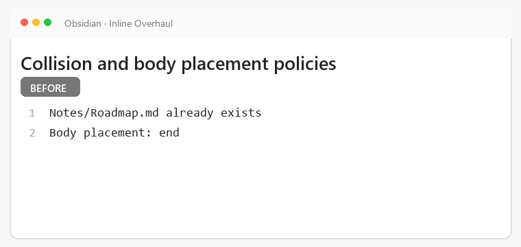

*Typical action: select policies in Transform settings, then run `Transform: inline2note`; its hotkey is configurable.*

### YAML Raw/Clean mapping

> [!CAUTION]
> Test in a sandbox vault or back up affected notes before writing mapped values into target frontmatter.

Map recognized inline fields into template/target frontmatter using Raw or Clean values.

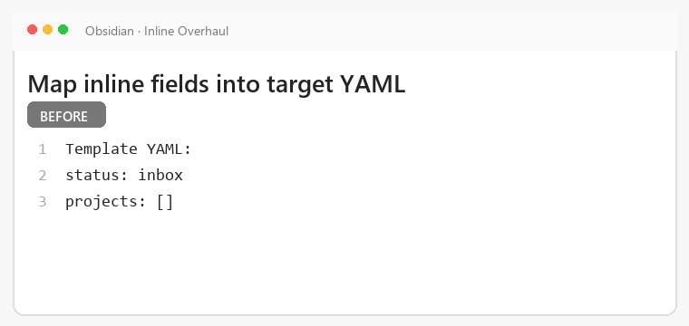

*Typical action: choose **YAML note format → Raw/Clean**, then run `Transform: inline2note`; its hotkey is configurable.*

### Source cleanup/link/processed token/sublines/open target

> [!CAUTION]
> Test in a sandbox vault or back up affected notes before changing source lines or generated targets.

Control source cleanup, replacement links, processed tokens, subline handling, and target opening.

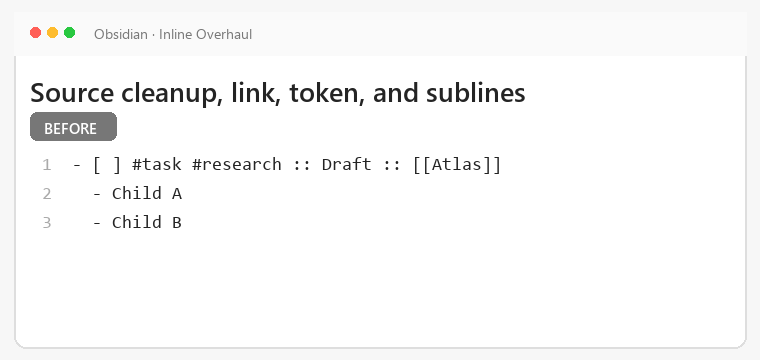

*Typical action: choose source-processing policies, then run `Transform: inline2note`; its hotkey is configurable.*

> [!NOTE]
> GIFs use low frame rates and narrow crops for faster GitHub loading. They contain synthetic demo text only.
